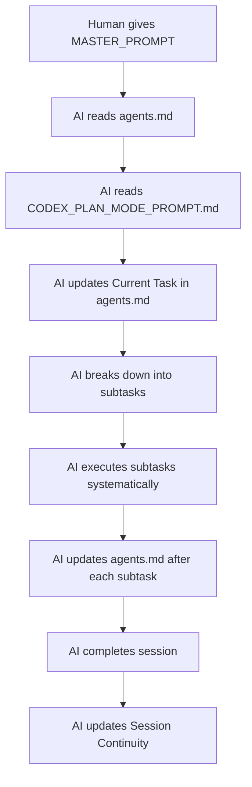
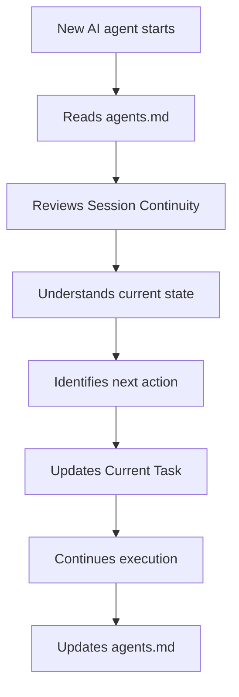

# 🤖 GPT Codex 2025 Plan Mode - AI Agent Self-Tracking System

## 📚 Complete Documentation Package

### Overview
This system enables AI agents to work systematically with full transparency, continuity, and quality control using GPT Codex 2025's Plan Mode capabilities.

---

## 🗂️ System Files

### 1. **agents.md** - The Core Task Tracker
**Purpose**: Central tracking file where AI agents record what's been done, what's active, and what's next.

**Location**: `.artifacts/agents.md`

**Sections**:
- ✅ Completed Tasks (history)
- 🎯 Current Task (active work)
- 📅 Upcoming Tasks (backlog)
- 📊 Analysis Context (repository structure)
- 🔄 Session Continuity (handoff notes)
- 💡 Notes & Observations (learnings)

**Usage**: 
- AI agents MUST read this FIRST before any action
- AI agents MUST update this after every subtask
- AI agents MUST fill Session Continuity before ending

---

### 2. **CODEX_PLAN_MODE_PROMPT.md** - The Plan Mode Manual
**Purpose**: Comprehensive guide on how to use GPT Codex 2025 Plan Mode properly.

**Location**: `.artifacts/CODEX_PLAN_MODE_PROMPT.md`

**Contents**:
- 📜 Mandatory First Action Protocol
- 🧠 Plan Mode Best Practices
- 📋 Task Execution Framework
- 🔄 agents.md Update Cadence
- 🛡️ Quality Standards
- 🚨 Error Handling Protocol
- 🎓 Learning & Improvement
- 📊 Progress Tracking
- ✅ Final Checklist

**Usage**:
- Read AFTER agents.md to understand standards
- Reference during execution for protocols
- Use as quality gate checklist

---

### 3. **QUICK_START_GUIDE.md** - The Practical Examples
**Purpose**: Step-by-step guide with concrete examples and common mistakes.

**Location**: `.artifacts/QUICK_START_GUIDE.md`

**Contents**:
- ⚡ Step-by-Step Execution Guide
- 🎯 Concrete Example: Current Task
- 📊 Quality Checklist
- 🚨 Common Mistakes to Avoid
- 🎓 Best Practices
- 📞 Help & Resources

**Usage**:
- Optional but recommended for first-time users
- Shows practical examples of good execution
- Highlights anti-patterns to avoid

---

### 4. **MASTER_PROMPT_FOR_AI_AGENT.txt** - The Copy-Paste Prompt
**Purpose**: Complete prompt ready to give to any AI agent to start execution.

**Location**: `.artifacts/MASTER_PROMPT_FOR_AI_AGENT.txt`

**Format**: Plain text, designed to be copy-pasted

**Contents**:
- ⚡ Mandatory First Actions
- 🎯 Primary Mission
- 📋 Execution Framework
- 🔄 Update Rules
- 🛡️ Quality Standards
- ⚠️ Anti-Patterns
- ✅ Completion Checklist
- 📊 Key Files Reference

**Usage**:
- Copy entire content
- Paste to AI agent (GPT Codex, Claude, etc.)
- Agent will self-initialize and begin systematic execution

---

## 🚀 How to Use This System

### For Human Operators

#### Option A: Give Agent the Master Prompt
```bash
1. Open: MASTER_PROMPT_FOR_AI_AGENT.txt
2. Copy entire content
3. Paste to AI agent
4. Agent will self-initialize and begin
```

#### Option B: Manual Step-by-Step
```bash
1. Tell agent to read: agents.md
2. Tell agent to read: CODEX_PLAN_MODE_PROMPT.md
3. Tell agent to update Current Task in agents.md
4. Tell agent to begin execution
```

### For AI Agents

#### Startup Sequence (MANDATORY)
```yaml
Step 1: READ agents.md
  - Understand context
  - Check completed tasks
  - Identify current task
  - Review upcoming tasks
  
Step 2: READ CODEX_PLAN_MODE_PROMPT.md
  - Learn execution standards
  - Understand quality gates
  - Review protocols
  
Step 3: UPDATE agents.md
  - Fill Current Task section
  - Break down into subtasks
  - Document plan
  
Step 4: BEGIN systematic execution
  - Execute subtasks one by one
  - Update agents.md after each
  - Create evidence artifacts
  - Pass quality gates
```

---

## 📊 File Relationships

```
┌─────────────────────────────────────────────────────────────┐
│ MASTER_PROMPT_FOR_AI_AGENT.txt                             │
│ (Entry point - copy/paste this to AI agent)                │
└────────────┬────────────────────────────────────────────────┘
             │
             ├──→ Points to agents.md (read first)
             ├──→ Points to CODEX_PLAN_MODE_PROMPT.md (read second)
             └──→ Points to QUICK_START_GUIDE.md (optional)
             
┌─────────────────────────────────────────────────────────────┐
│ agents.md                                                   │
│ (Central task tracker - living document)                   │
└────────────┬────────────────────────────────────────────────┘
             │
             ├──→ Updated continuously during execution
             ├──→ Tracks: completed, current, upcoming tasks
             ├──→ Session continuity & handoff notes
             └──→ Source of truth for all work
             
┌─────────────────────────────────────────────────────────────┐
│ CODEX_PLAN_MODE_PROMPT.md                                  │
│ (Standards & protocols - reference manual)                 │
└────────────┬────────────────────────────────────────────────┘
             │
             ├──→ Defines quality standards
             ├──→ Execution framework
             ├──→ Error handling protocols
             └──→ Update rules for agents.md
             
┌─────────────────────────────────────────────────────────────┐
│ QUICK_START_GUIDE.md                                       │
│ (Examples & best practices - learning aid)                 │
└────────────┬────────────────────────────────────────────────┘
             │
             ├──→ Shows practical examples
             ├──→ Common mistakes to avoid
             └──→ Best practices
```

---

## 🎯 The Analysis Target

### Primary Directory
```
.artifacts/
```

### Structure
```
.artifacts/
├── agents.md                         ⭐ The task tracker
├── CODEX_PLAN_MODE_PROMPT.md        ⭐ The manual
├── QUICK_START_GUIDE.md             ⭐ The examples
├── MASTER_PROMPT_FOR_AI_AGENT.txt   ⭐ The entry point
├── README_AI_AGENT_SYSTEM.md        ⭐ This file
│
├── meta-upgrades/                    📦 Analysis target
│   ├── UPG01/                        (intent, analysis, decision, alignment)
│   ├── UPG02/ ... UPG10/            
│   ├── catalog/
│   ├── cross/
│   ├── final/
│   ├── integration/
│   └── pop/
│
├── protocol-01/                      📋 Protocol artifacts
├── protocol-23/                      
├── scripts/                          🔧 Automation scripts
├── validation/                       ✅ Validation reports
└── governance-index.json             🗂️ Governance tracking
```

---

## 🔄 Typical Workflow

### Session 1: Initial Analysis


### Session 2: Continuation


---

## 🛡️ Quality Assurance

### Built-in Quality Gates

Every task must pass:
- ✅ **Structural Compliance** - Follows patterns
- ✅ **Content Accuracy** - Verified data
- ✅ **Completeness** - No missing fields
- ✅ **Consistency** - Aligns with existing work
- ✅ **Traceability** - Clear evidence trail

### Evidence Requirements

Every completed task must have:
- ✅ **Artifacts Created** - JSON/MD files
- ✅ **Validation Passed** - Quality checks
- ✅ **Documentation Updated** - agents.md
- ✅ **Integration Verified** - Works with system
- ✅ **Handoff Clear** - Next steps documented

---

## 📚 Best Practices

### ✅ Do This
1. **Always read agents.md first** - Context is critical
2. **Break big tasks down** - 8-10 manageable subtasks
3. **Update agents.md frequently** - After every subtask
4. **Create evidence artifacts** - Don't keep in memory
5. **Document decisions** - As you make them
6. **Handle blockers immediately** - Don't defer
7. **Write clear handoffs** - Next agent needs context

### ❌ Don't Do This
1. Skip reading agents.md
2. Take on huge tasks without breakdown
3. Update agents.md only at the end
4. Keep analysis in memory only
5. Make decisions without documentation
6. Ignore blockers and continue
7. End session without handoff notes

---

## 🚨 Troubleshooting

### Problem: Agent doesn't know what to do
**Solution**: Agent didn't read agents.md first. Give MASTER_PROMPT again.

### Problem: Agent loses context between sessions
**Solution**: Session Continuity wasn't filled out. Previous agent failed protocol.

### Problem: Work is duplicated
**Solution**: Agent didn't check Completed Tasks in agents.md before starting.

### Problem: Quality is inconsistent
**Solution**: Agent isn't following CODEX_PLAN_MODE_PROMPT.md standards.

### Problem: Can't track progress
**Solution**: agents.md isn't being updated after each subtask.

---

## 🎓 Learning Resources

### For Humans
- **Read**: MASTER_PROMPT_FOR_AI_AGENT.txt (overview)
- **Read**: QUICK_START_GUIDE.md (examples)
- **Reference**: CODEX_PLAN_MODE_PROMPT.md (when deep dive needed)

### For AI Agents
- **Always read first**: agents.md
- **Always read second**: CODEX_PLAN_MODE_PROMPT.md
- **Reference as needed**: QUICK_START_GUIDE.md
- **Update continuously**: agents.md

---

## 📊 Success Metrics

### Task Completion Quality
- ✅ 100% of tasks have evidence artifacts
- ✅ 100% of tasks pass quality gates
- ✅ 100% of tasks documented in agents.md
- ✅ 100% of sessions have handoff notes

### System Effectiveness
- ✅ Zero duplicated work (checked Completed Tasks)
- ✅ Zero context loss (Session Continuity filled)
- ✅ Zero quality failures (gates enforced)
- ✅ Zero orphaned work (clear traceability)

---

## 🔗 Integration Points

### With AI-Driven Workflow System
- **Protocol 10**: Process Tasks (task execution)
- **Protocol 12**: Quality Audit (validation)
- **Protocol 23**: Script Governance (automation)
- **Master Rule 2**: AI Collaboration Guidelines

### Automation Hooks
```bash
python scripts/validate_protocols.py
python scripts/validate_evidence.py
python scripts/run_quality_audit.py
```

---

## 🚀 Getting Started NOW

### Quickest Path (Copy-Paste)
```bash
1. Open: MASTER_PROMPT_FOR_AI_AGENT.txt
2. Copy ALL content
3. Paste to your AI agent (GPT Codex, Claude, etc.)
4. Done! Agent will self-initialize
```

### Understanding Path (Read First)
```bash
1. Read: This README (you are here)
2. Read: QUICK_START_GUIDE.md (examples)
3. Read: CODEX_PLAN_MODE_PROMPT.md (deep dive)
4. Use: MASTER_PROMPT_FOR_AI_AGENT.txt (to start agent)
```

---

## 📝 Version & Updates

**System Version**: 1.0  
**Created**: 2025-10-28  
**Last Updated**: 2025-10-28  
**Based On**: GPT Codex 2025 Plan Mode Research  
**Compatible With**: GPT-5-Codex, Claude, and other plan-mode capable AI

---

## 🎯 Summary

This system transforms AI agents from simple code generators into systematic, evidence-based execution engines with:

- ✨ **Full Transparency** via agents.md tracking
- ✨ **Perfect Continuity** via Session Handoffs
- ✨ **Quality Assurance** via built-in gates
- ✨ **Systematic Execution** via Plan Mode protocols
- ✨ **Evidence-Based** via artifact creation
- ✨ **Self-Managing** via update protocols

**Start with**: MASTER_PROMPT_FOR_AI_AGENT.txt  
**Track with**: agents.md  
**Execute per**: CODEX_PLAN_MODE_PROMPT.md  
**Learn from**: QUICK_START_GUIDE.md  

---

**Ready? Copy MASTER_PROMPT_FOR_AI_AGENT.txt and paste to your AI agent!** 🚀

