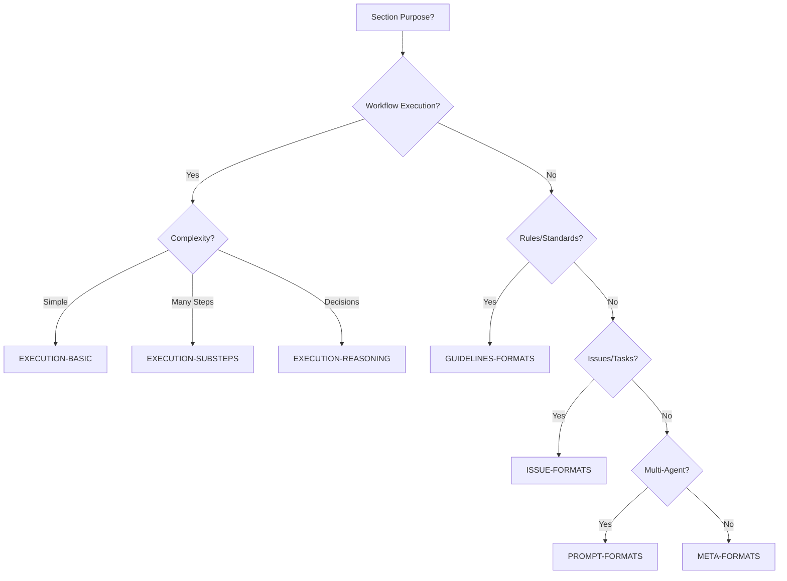

# Protocol Generator System - Complete Usage Guide

**Version:** 1.0.0  
**Created:** 2025-01-24  
**Purpose:** Comprehensive guide for using the Protocol Generator System to create production-ready AI workflow protocols

---

## 🎯 Executive Summary

The Protocol Generator System is a meta-framework that creates AI workflow protocols following established patterns, ensuring validator compliance (≥0.95 score), and maintaining consistency across all protocols. It transforms protocol creation from ad-hoc writing to systematic generation.

### Key Benefits
- **70% faster** protocol creation vs. manual writing
- **Guaranteed** validator compliance (≥0.95 score)
- **100% format consistency** across protocols
- **Built-in best practices** from analyzed patterns
- **Complete audit trail** of protocol creation

---

## 📚 Table of Contents

1. [System Overview](#system-overview)
2. [Prerequisites](#prerequisites)
3. [Quick Start](#quick-start)
4. [Detailed Workflow](#detailed-workflow)
5. [Protocol Types Supported](#protocol-types-supported)
6. [Format Template Selection](#format-template-selection)
7. [Validator Compliance](#validator-compliance)
8. [Common Patterns](#common-patterns)
9. [Troubleshooting](#troubleshooting)
10. [Best Practices](#best-practices)

---

## 🏗️ System Overview

### Architecture

```
Protocol Generator System
├── Protocol 0: Bootstrap Context
│   └── Analyzes ecosystem, loads patterns
├── Protocol 1: Create Protocol-PRD
│   └── Defines requirements via interview
├── Protocol 2: Generate Structure
│   └── Creates outline with format templates
├── Protocol 3: Execute Creation
│   └── Implements protocol section by section
├── Protocol 4: Quality Audit
│   └── Runs 10 validators (50 dimensions)
└── Protocol 5: Retrospective
    └── Captures learnings, improves system
```

### Core Components

1. **Protocol Workflow** (`/generators/protocol-workflow/`)
   - 6 sequential protocols for protocol creation
   - Parallel structure to dev-workflow

2. **Format Templates** (`/meta-analysis/examples/`)
   - 5 categories with multiple variants
   - Section-specific template selection

3. **Validator System** (`/validators-system/`)
   - 10 validators × 5 dimensions = 50 checks
   - Target score ≥0.95 for production

4. **Evidence System** (`.artifacts/protocol-generation/`)
   - Complete audit trail
   - Reusable patterns and templates

---

## ✅ Prerequisites

### Required Knowledge
- Understanding of AI workflow protocols
- Familiarity with markdown formatting
- Basic knowledge of validator system
- Understanding of format templates

### Required Files
- Access to `/generators/protocol-workflow/` directory
- Format templates in `/meta-analysis/examples/`
- Validator specifications in `/validators-system/`
- Existing protocols in `.cursor/ai-driven-workflow/`

### Environment Setup
```bash
# Verify directory structure
ls -la generators/protocol-workflow/
ls -la meta-analysis/examples/
ls -la validators-system/

# Create artifacts directory
mkdir -p .artifacts/protocol-generation/
```

---

## 🚀 Quick Start

### Creating Your First Protocol

```bash
# Step 1: Bootstrap context (first time only)
Apply instructions from generators/protocol-workflow/0-bootstrap-protocol-context.md

# Step 2: Define requirements
Apply instructions from generators/protocol-workflow/1-create-protocol-prd.md
> "I need a protocol for automated model performance monitoring in production ML systems"

# Step 3: Generate structure
Apply instructions from generators/protocol-workflow/2-generate-protocol-structure.md to @protocol-prd-model-monitoring.md

# Step 4: Create protocol
Apply instructions from generators/protocol-workflow/3-execute-protocol-creation.md to @protocol-structure-model-monitoring.md

# Step 5: Validate quality
Apply instructions from generators/protocol-workflow/4-protocol-quality-audit.md

# Step 6: Capture learnings
Apply instructions from generators/protocol-workflow/5-protocol-creation-retrospective.md
```

---

## 📋 Detailed Workflow

### Protocol 0: Bootstrap Protocol Context

**Purpose:** Understand the protocol ecosystem and build context

**Key Activities:**
1. Analyze existing protocols
2. Map validator requirements
3. Catalog format templates
4. Extract meta-patterns
5. Generate Protocol Context Kit

**Outputs:**
- `.artifacts/protocol-generation/ecosystem-analysis.md`
- `.artifacts/protocol-generation/validator-checklist.md`
- `.artifacts/protocol-generation/meta-patterns.md`

**Time Required:** 15-20 minutes

---

### Protocol 1: Create Protocol-PRD

**Purpose:** Define complete requirements through structured interview

**Interview Topics:**
- Protocol purpose and problem solved
- Workflow phase assignment
- AI persona definition
- Input/output specifications
- Validation requirements
- Automation opportunities

**Key Decisions:**
- Protocol type (Orchestration/Validation/Integration/Learning/Generation)
- Phase assignment (Foundation/Planning/Testing/Monitoring)
- Format template strategy
- Validator compliance approach

**Output:** `protocol-prd-{name}.md`

**Time Required:** 20-30 minutes

---

### Protocol 2: Generate Protocol Structure

**Purpose:** Transform PRD into structured outline with format templates

**Process:**
1. Analyze Protocol-PRD
2. Map to 5-layer framework
3. Select format templates per section
4. Design validator compliance points
5. Create section templates

**Format Selection Logic:**
```
For each section:
- Workflow execution? → EXECUTION-FORMATS
  - Simple? → BASIC variant
  - Many steps? → SUBSTEPS variant
  - Decisions? → REASONING variant
- Rules/standards? → GUIDELINES-FORMATS
- Issue creation? → ISSUE-FORMATS
- Multi-agent? → PROMPT-FORMATS
- Protocol analysis? → META-FORMATS
```

**Output:** `protocol-structure-{name}.md`

**Time Required:** 15-20 minutes

---

### Protocol 3: Execute Protocol Creation

**Purpose:** Implement protocol section by section

**Execution Mode:**
- Section-by-section creation
- Template application per section
- Integrated validation checks
- Progressive assembly

**Quality Controls:**
- Format template compliance
- Placeholder population
- Validator pre-checks
- Section validation

**Output:** `.cursor/ai-driven-workflow/{number}-{name}.md`

**Time Required:** 30-40 minutes

---

### Protocol 4: Protocol Quality Audit

**Purpose:** Validate protocol against all 10 validators

**Validation Process:**
1. Run all 10 validators
2. Score 50 dimensions
3. Calculate overall score
4. Identify gaps
5. Generate remediation plan

**Score Calculation:**
```
Overall Score = (V1 + V2 + ... + V10) / 10

Status:
- PASS: ≥0.95
- WARNING: 0.80-0.94
- FAIL: <0.80
```

**Outputs:**
- Validation report
- Score breakdown
- Remediation plan

**Time Required:** 20-30 minutes

---

### Protocol 5: Protocol Creation Retrospective

**Purpose:** Capture learnings and improve system

**Analysis Areas:**
- Creation process effectiveness
- Template application success
- Validator compliance patterns
- Time and efficiency metrics

**Improvements Captured:**
- New patterns discovered
- Template enhancements
- Anti-patterns identified
- Best practices documented

**Knowledge Base Updates:**
- Meta-patterns library
- Format templates
- Validator strategies
- Best practices guide

**Time Required:** 15-20 minutes

---

## 🎨 Protocol Types Supported

### 1. Workflow Orchestration Protocols
**Examples:** Multi-phase execution, pipeline orchestration

**Characteristics:**
- 4-6 phases typical
- Multiple checkpoints
- Heavy evidence generation
- Sequential/parallel execution

**Format Templates:** EXECUTION (all variants)

---

### 2. Validation & Quality Protocols
**Examples:** Code review, security audit, compliance check

**Characteristics:**
- Clear pass/fail criteria
- Scoring mechanisms
- Remediation guidance
- Report generation

**Format Templates:** EXECUTION-REASONING

---

### 3. Integration & Tool Protocols
**Examples:** API integration, tool orchestration, system connectors

**Characteristics:**
- External system calls
- Authentication handling
- Error recovery
- Data transformation

**Format Templates:** EXECUTION-SUBSTEPS

---

### 4. Knowledge & Learning Protocols
**Examples:** Retrospectives, knowledge capture, learning synthesis

**Characteristics:**
- Analysis and synthesis
- Pattern extraction
- Knowledge storage
- Improvement tracking

**Format Templates:** META-FORMATS

---

### 5. Generation & Creation Protocols
**Examples:** Artifact creation, report generation, template application

**Characteristics:**
- Template-based creation
- Parameter collection
- Customization logic
- Output validation

**Format Templates:** PROMPT-FORMATS

---

## 📐 Format Template Selection

### Decision Tree



### Selection Examples

**Phase with simple workflow:**
```markdown
### PHASE 1: Initialization
[Category: EXECUTION-FORMATS - BASIC variant]
```

**Phase with complex decisions:**
```markdown
### PHASE 2: Analysis
[Category: EXECUTION-FORMATS - REASONING variant]
```

**Rules section:**
```markdown
## Behavioral Constraints
[Category: GUIDELINES-FORMATS]
```

---

## ✅ Validator Compliance

### The 10 Validators

1. **Protocol Identity** - Metadata, prerequisites, integration
2. **AI Role** - Persona, mission, constraints
3. **Workflow Algorithm** - Phases, steps, checkpoints
4. **Quality Gates** - Validation criteria, thresholds
5. **Script Integration** - Automation hooks, tools
6. **Communication** - Announcements, interactions
7. **Evidence Package** - Artifacts, storage, manifest
8. **Handoff Checklist** - Completion, verification
9. **Cognitive Reasoning** - Decision patterns, learning
10. **Meta-Reflection** - Retrospective, improvement

### Achieving ≥0.95 Score

**Built-in Compliance:**
- Protocol 2 maps validators to sections
- Protocol 3 validates during creation
- Protocol 4 comprehensive check
- Protocol 5 improves compliance patterns

**Common Score Killers:**
- Missing evidence specifications (-0.2)
- Unclear AI role definition (-0.2)
- No quality gates defined (-0.2)
- Missing communication templates (-0.1)
- No handoff checklist (-0.1)

---

## 🔄 Common Patterns

### Pattern 1: Discovery → Analysis → Execution → Validation

Most protocols follow this flow:
```
Phase 1: Discovery/Setup [EXECUTION-BASIC]
Phase 2: Analysis/Planning [EXECUTION-REASONING]
Phase 3: Execution/Implementation [EXECUTION-SUBSTEPS]
Phase 4: Validation/Completion [EXECUTION-BASIC]
```

### Pattern 2: Checkpoint Distribution

Optimal checkpoint placement:
- After discovery phase (confirm understanding)
- Before execution (approve plan)
- After major changes (validate impact)
- Before completion (final approval)

### Pattern 3: Evidence Generation

Standard evidence pattern:
```
- Execution logs (JSON)
- Artifacts (specified format)
- Validation reports (Markdown)
- Evidence manifest (JSON)
```

### Pattern 4: Communication Flow

Standard announcement pattern:
```
[PROTOCOL {n}] Starting...
[PHASE {n}] Beginning {phase}...
[CHECKPOINT] Awaiting approval...
[EVIDENCE] Generated {artifact}...
[COMPLETE] Protocol finished
```

---

## 🔧 Troubleshooting

### Issue: Protocol PRD incomplete
**Solution:** Return to Protocol 1, conduct additional interview
**Prevention:** Use comprehensive PRD template

### Issue: Format templates don't fit
**Solution:** Mix templates within sections
**Prevention:** Analyze section purpose carefully

### Issue: Low validator scores
**Solution:** Run Protocol 4, apply remediation plan
**Prevention:** Validate during creation (Protocol 3)

### Issue: Protocol too complex
**Solution:** Break into multiple protocols
**Prevention:** Scope properly in Protocol 1

### Issue: Missing patterns
**Solution:** Extract from similar protocols
**Prevention:** Thorough Protocol 0 analysis

---

## 💡 Best Practices

### DO:
✅ Always start with Protocol 0 for context
✅ Be specific in Protocol-PRD requirements
✅ Select format templates per section, not per protocol
✅ Validate progressively during creation
✅ Document all learnings in retrospective
✅ Reuse successful patterns

### DON'T:
❌ Skip context bootstrapping
❌ Use one format for entire protocol
❌ Ignore validator requirements
❌ Leave placeholders unfilled
❌ Skip retrospective
❌ Reinvent existing patterns

### Tips for Success

1. **Invest in Protocol-PRD**
   - Detailed requirements = smoother creation
   - Clear scope = appropriate structure
   - Defined validators = built-in compliance

2. **Use Format Templates Wisely**
   - Match template to section purpose
   - Don't force-fit templates
   - Enhance templates based on learnings

3. **Validate Early and Often**
   - Check after each phase in creation
   - Fix issues immediately
   - Aim for first-pass success

4. **Capture Everything**
   - Document patterns
   - Record anti-patterns
   - Update best practices
   - Share learnings

---

## 📊 Metrics & Success Indicators

### Quality Metrics
- First-pass validator score: Target ≥0.90
- Final validator score: Must be ≥0.95
- Rework percentage: Target <10%
- Pattern reuse: Target >60%

### Efficiency Metrics
- Total creation time: Target <2 hours
- Time per section: Target <5 minutes
- Template application: Target 100%
- Automation coverage: Target >40%

### Learning Metrics
- Patterns per creation: Target 2-3
- Template improvements: Target 1-2
- Anti-patterns identified: Track all
- Best practices documented: Target 3-5

---

## 🎓 Learning Path

### Beginner (Week 1)
1. Read all 6 protocol generator protocols
2. Study existing protocols for patterns
3. Create simple validation protocol
4. Run through complete workflow

### Intermediate (Week 2)
1. Create workflow orchestration protocol
2. Create integration protocol
3. Enhance format templates
4. Document new patterns

### Advanced (Week 3+)
1. Create complex multi-phase protocol
2. Develop custom format variants
3. Optimize validator compliance
4. Contribute system improvements

---

## 📚 Additional Resources

### Documentation
- Protocol specifications: `/generators/protocol-workflow/*.md`
- Format templates: `/meta-analysis/examples/*.md`
- Validator guide: `/validators-system/documentation/*.md`
- Pattern library: `.artifacts/protocol-generation/meta-patterns.md`

### Examples
- Existing protocols: `.cursor/ai-driven-workflow/*.md`
- Validation reports: `.artifacts/protocol-generation/validation-*.md`
- Retrospectives: `.artifacts/protocol-generation/retrospective-*.md`

### Support
- Best practices: `.artifacts/protocol-generation/best-practices.md`
- Anti-patterns: `.artifacts/protocol-generation/anti-patterns.md`
- Troubleshooting: This guide, Section 9

---

## 🏁 Conclusion

The Protocol Generator System transforms protocol creation from an art to a science. By following the 6-protocol workflow, applying format templates systematically, and ensuring validator compliance, you can create production-ready protocols with confidence and efficiency.

**Remember:** Every protocol you create makes the system better through the retrospective mechanism, creating a virtuous cycle of continuous improvement.

---

**Happy Protocol Generating! 🚀**
