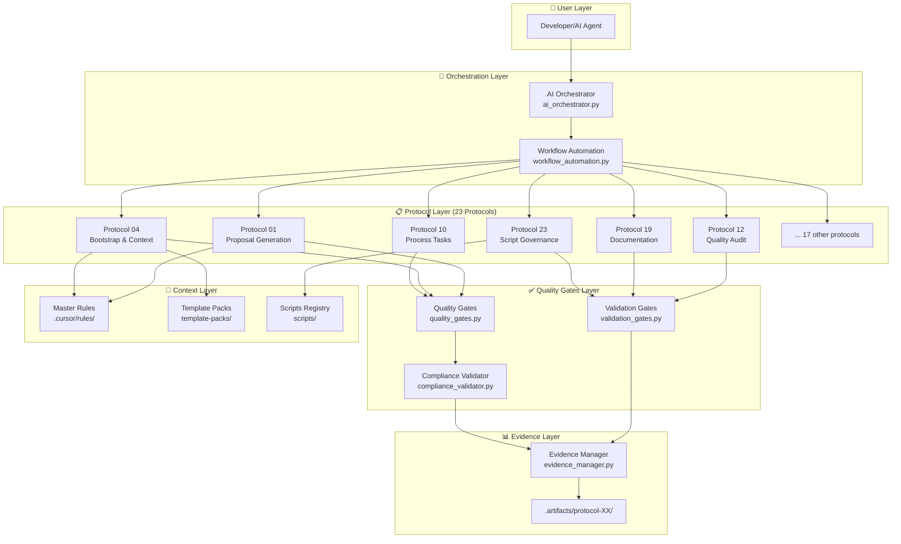
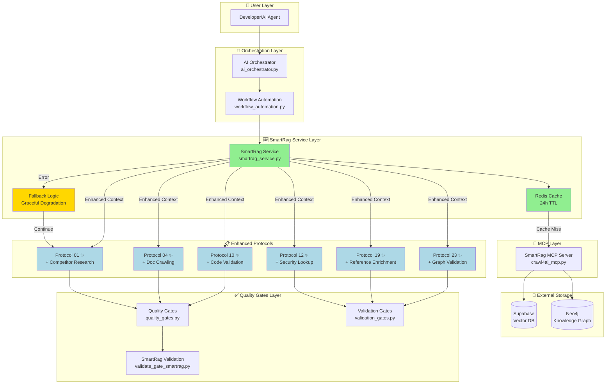
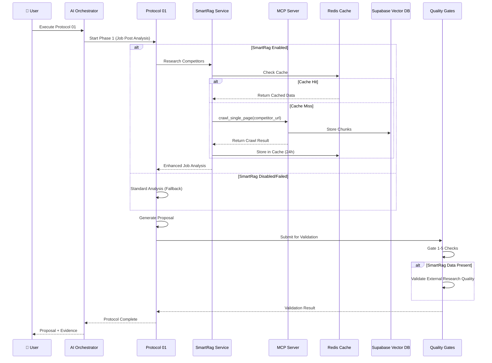
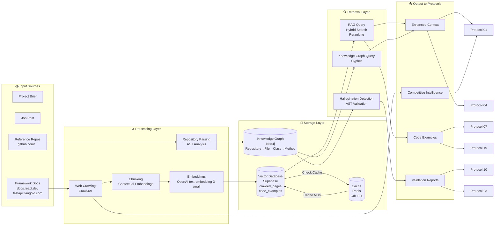
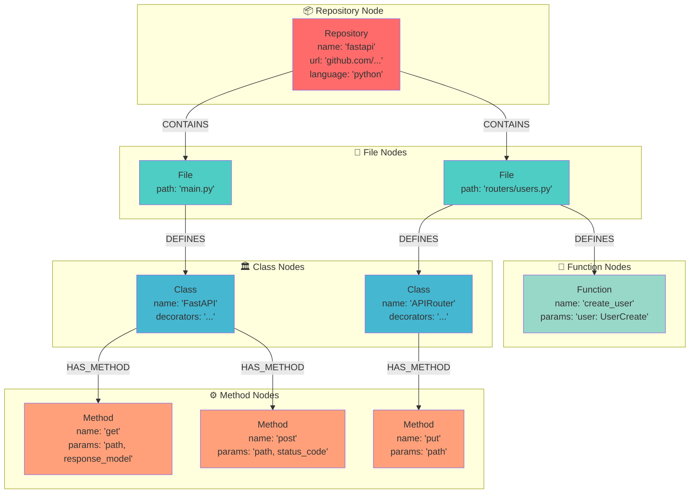
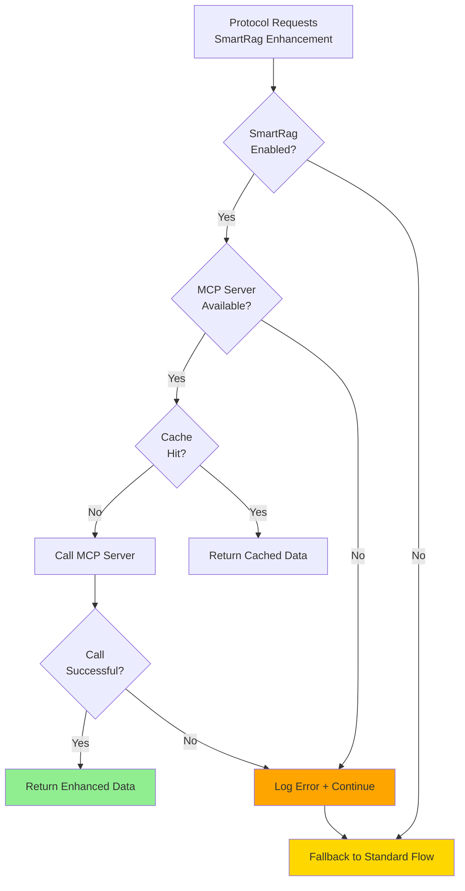
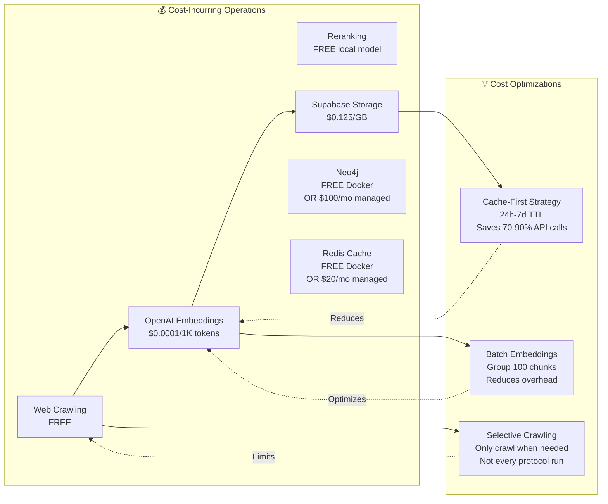
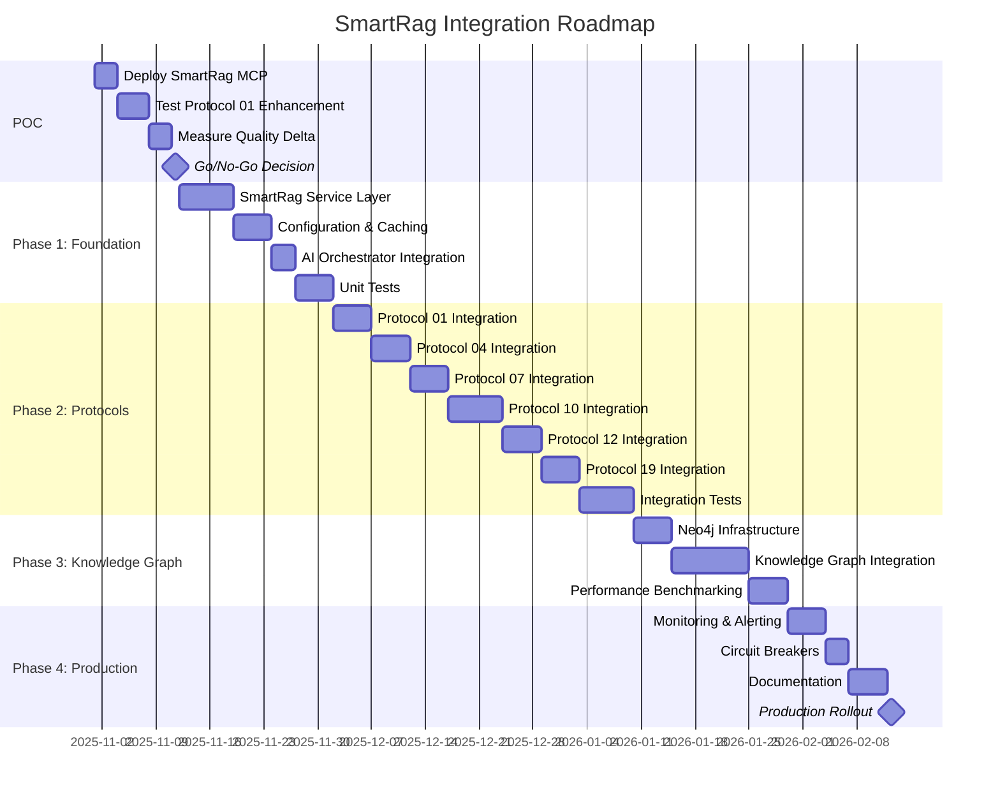
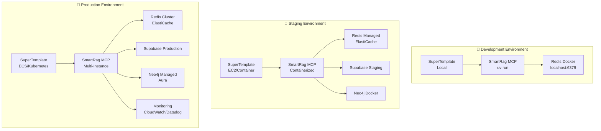
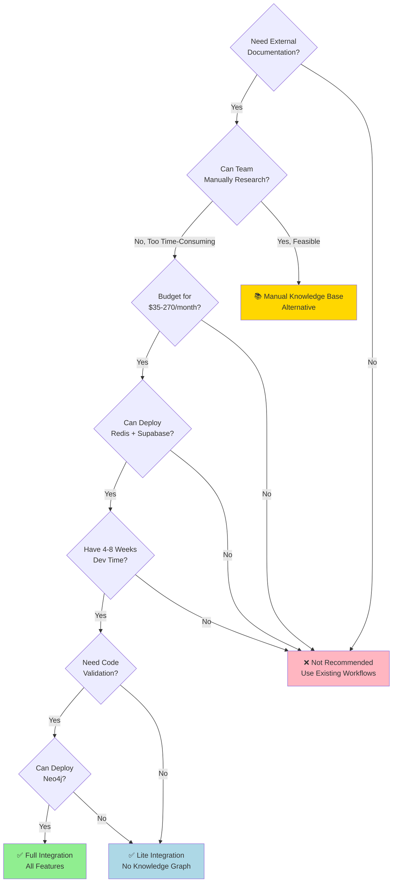

# SmartRag Integration Architecture Diagrams

**Visual Reference for SuperTemplate + SmartRag Integration**

---

## 1. Current SuperTemplate Architecture



---

## 2. Proposed SmartRag Integration (Service Layer Pattern)



**Legend:**
- 🟢 Green: New components
- 🔵 Blue: Enhanced protocols
- 🟡 Yellow: Safety mechanisms

---

## 3. Protocol Flow with SmartRag Enhancement

### Example: Protocol 01 (Client Proposal Generation)



---

## 4. Data Flow Architecture



---

## 5. Knowledge Graph Structure (Neo4j)



**Validation Example:**
```python
# AI generates this code:
app = FastAPI()
app.invalid_method("/users")  # ❌ Hallucination!

# Knowledge Graph Validator checks:
# 1. Does FastAPI class exist? ✅ Yes
# 2. Does it have method 'invalid_method'? ❌ No
# 3. Report hallucination with confidence: 95%
```

---

## 6. Error Handling & Fallback Flow



**Key Principles:**
1. ✅ **Never block on SmartRag failure**
2. ✅ **Always have fallback logic**
3. ✅ **Log errors for monitoring**
4. ✅ **Continue with standard flow**

---

## 7. Cost Flow Analysis



**Monthly Cost Estimate:**
```
Base Case (100 protocol runs/month):
  OpenAI Embeddings: $10-30
  Supabase: $0-25 (free tier sufficient)
  Redis: $0 (Docker) or $20 (managed)
  Neo4j: $0 (Docker) or $100 (managed)
  Total: $10-175/month

With Cache (70% hit rate):
  OpenAI Embeddings: $3-9
  Total: $3-134/month
```

---

## 8. Integration Timeline



**Key Milestones:**
- **Week 2:** POC Go/No-Go Decision
- **Week 6:** Phase 1 Complete (Foundation)
- **Week 12:** Phase 2 Complete (Protocols)
- **Week 16:** Phase 3 Complete (Knowledge Graph)
- **Week 18:** Production Rollout

---

## 9. Deployment Architecture



---

## 10. Decision Tree: Should You Use SmartRag?



---

**Visual Summary Complete!**

These diagrams provide:
1. ✅ Architectural overview (current vs. proposed)
2. ✅ Data flow visualization
3. ✅ Error handling patterns
4. ✅ Cost analysis
5. ✅ Integration timeline
6. ✅ Decision guidance

**Next:** Review main analysis (`SMARTRAG_INTEGRATION_ANALYSIS.md`) and quick start guide (`SMARTRAG_QUICK_START.md`).


