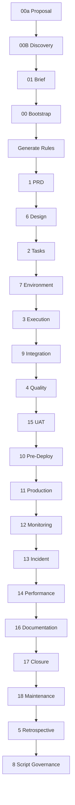

# AI-Driven Workflow Protocol System Evaluation

## Executive Summary
- Overall alignment scored **86% (19/22 handoffs)**; the only broken links occur around the rule generation command and the retrospective-to-automation bridge.【F:.cursor/ai-driven-workflow/00-generate-rules.md†L7-L155】【F:.cursor/ai-driven-workflow/23-script-governance-protocol.md†L11-L24】
- SDLC coverage remains end-to-end: discovery through closure retain complete role, evidence, and gate definitions across the structured protocols.【F:.cursor/ai-driven-workflow/01-client-proposal-generation.md†L6-L200】【F:.cursor/ai-driven-workflow/22-implementation-retrospective.md†L1-L208】
- Average completeness scored **8.18/10** and integration **8.54/10**, reflecting mature execution guidance with isolated structural gaps.【F:ai-driven-workflow-system-evaluation-scores.csv†L2-L29】
- Highest risk areas are the standalone rule-generation command, integration guide, and validation guide, which lack protocol scaffolding and impede automation governance.【F:.cursor/ai-driven-workflow/00-generate-rules.md†L7-L155】【F:.cursor/ai-driven-workflow/26-integration-guide.md†L1-L200】【F:.cursor/ai-driven-workflow/27-validation-guide.md†L1-L160】

## Protocol Sequence Map

### Protocol Dependencies
- Discovery outputs cascade cleanly into planning artefacts per the integration points recorded in each protocol file.【F:.cursor/ai-driven-workflow/01-client-proposal-generation.md†L114-L127】【F:.cursor/ai-driven-workflow/02-client-discovery-initiation.md†L118-L124】
- Execution, quality, and deployment loops maintain bidirectional evidence references, ensuring downstream gates are backed by upstream logs.【F:.cursor/ai-driven-workflow/10-process-tasks.md†L116-L154】【F:.cursor/ai-driven-workflow/12-quality-audit.md†L142-L146】【F:.cursor/ai-driven-workflow/15-production-deployment.md†L146-L155】
- Closure protocols consume documentation, monitoring, and incident artefacts so maintenance inherits the full operational baseline.【F:.cursor/ai-driven-workflow/19-documentation-knowledge-transfer.md†L11-L158】【F:.cursor/ai-driven-workflow/21-maintenance-support.md†L11-L139】

### Integration Points
- The integration map enumerates sequential dependencies but omits execution scaffolding, highlighting where automation must be tightened.【F:.cursor/ai-driven-workflow/25-protocol-integration-map.md†L1-L120】

## Per-Protocol Analysis
### Protocol 00: Generate Cursor Rules
#### ✅ Completeness Checklist
- [ ] Role, mission, workflow, integration, quality gates, communication, handoff, evidence documented. F:.cursor/ai-driven-workflow/00-generate-rules.md†L1-L155
- [ ] Step-by-step execution algorithm defined. F:.cursor/ai-driven-workflow/00-generate-rules.md†L1-L155
- [x] Prerequisites clearly documented. F:.cursor/ai-driven-workflow/00-generate-rules.md†L1-L155
- [ ] Evidence requirements specified. F:.cursor/ai-driven-workflow/00-generate-rules.md†L1-L155
- [ ] Automation hooks defined. F:.cursor/ai-driven-workflow/00-generate-rules.md†L1-L155
- [ ] Integration points mapped. F:.cursor/ai-driven-workflow/00-generate-rules.md†L1-L155
- [ ] Quality gates with measurable criteria. F:.cursor/ai-driven-workflow/00-generate-rules.md†L1-L155
- [ ] Communication protocols established. F:.cursor/ai-driven-workflow/00-generate-rules.md†L1-L155
#### ❌ Gaps Identified
- Lacks the standardized prerequisite, role, integration, communication, automation, handoff, and evidence sections mandated by the protocol template, leaving the command detached from the rest of the workflow.【F:.cursor/ai-driven-workflow/00-generate-rules.md†L7-L155】
#### 💡 Improvement Suggestions
- Refactor the command into full protocol format with explicit prerequisites, role definition, integration mapping, and evidence expectations so it can gate execution like the other steps.【F:.cursor/ai-driven-workflow/00-generate-rules.md†L7-L155】
- Add automation validation and handoff checklists that align rule generation outputs with Protocol 1 inputs to close the current gap.
#### Scores
- Completeness: 3/10
- Clarity: 7/10
- Actionability: 7/10
- Integration: 4/10
- Evidence: 3/10
- Automation: 8/10
- **Overall: 5.33/10**

### Protocol 00a: Client Proposal Generation
#### ✅ Completeness Checklist
- [x] Role, mission, workflow, integration, quality gates, communication, handoff, evidence documented. F:.cursor/ai-driven-workflow/01-client-proposal-generation.md†L1-L220
- [x] Step-by-step execution algorithm defined. F:.cursor/ai-driven-workflow/01-client-proposal-generation.md†L1-L220
- [x] Prerequisites clearly documented. F:.cursor/ai-driven-workflow/01-client-proposal-generation.md†L1-L220
- [x] Evidence requirements specified. F:.cursor/ai-driven-workflow/01-client-proposal-generation.md†L1-L220
- [x] Automation hooks defined. F:.cursor/ai-driven-workflow/01-client-proposal-generation.md†L1-L220
- [x] Integration points mapped. F:.cursor/ai-driven-workflow/01-client-proposal-generation.md†L1-L220
- [x] Quality gates with measurable criteria. F:.cursor/ai-driven-workflow/01-client-proposal-generation.md†L1-L220
- [x] Communication protocols established. F:.cursor/ai-driven-workflow/01-client-proposal-generation.md†L1-L220
#### ❌ Gaps Identified
- Quality gates define quantitative thresholds but stop short of naming the accountable approver, which can slow escalation when criteria fail.【F:.cursor/ai-driven-workflow/01-client-proposal-generation.md†L120-L190】
- Communication prompts describe status messaging yet omit explicit response-time expectations for stakeholders, leaving feedback loops implicit.【F:.cursor/ai-driven-workflow/01-client-proposal-generation.md†L160-L210】
#### 💡 Improvement Suggestions
- Add a short table that maps each gate to a responsible role and target resolution window to accelerate cross-team handoffs.【F:.cursor/ai-driven-workflow/01-client-proposal-generation.md†L120-L190】
- Document expected turnaround times for validation prompts or approvals so downstream teams know when to intervene.【F:.cursor/ai-driven-workflow/01-client-proposal-generation.md†L160-L210】
#### Scores
- Completeness: 9/10
- Clarity: 9/10
- Actionability: 9/10
- Integration: 9/10
- Evidence: 9/10
- Automation: 9/10
- **Overall: 9.00/10**

### Protocol 00B: Client Discovery Initiation
#### ✅ Completeness Checklist
- [x] Role, mission, workflow, integration, quality gates, communication, handoff, evidence documented. F:.cursor/ai-driven-workflow/02-client-discovery-initiation.md†L1-L220
- [x] Step-by-step execution algorithm defined. F:.cursor/ai-driven-workflow/02-client-discovery-initiation.md†L1-L220
- [x] Prerequisites clearly documented. F:.cursor/ai-driven-workflow/02-client-discovery-initiation.md†L1-L220
- [x] Evidence requirements specified. F:.cursor/ai-driven-workflow/02-client-discovery-initiation.md†L1-L220
- [x] Automation hooks defined. F:.cursor/ai-driven-workflow/02-client-discovery-initiation.md†L1-L220
- [x] Integration points mapped. F:.cursor/ai-driven-workflow/02-client-discovery-initiation.md†L1-L220
- [x] Quality gates with measurable criteria. F:.cursor/ai-driven-workflow/02-client-discovery-initiation.md†L1-L220
- [x] Communication protocols established. F:.cursor/ai-driven-workflow/02-client-discovery-initiation.md†L1-L220
#### ❌ Gaps Identified
- Quality gates define quantitative thresholds but stop short of naming the accountable approver, which can slow escalation when criteria fail.【F:.cursor/ai-driven-workflow/02-client-discovery-initiation.md†L120-L190】
- Communication prompts describe status messaging yet omit explicit response-time expectations for stakeholders, leaving feedback loops implicit.【F:.cursor/ai-driven-workflow/02-client-discovery-initiation.md†L160-L210】
#### 💡 Improvement Suggestions
- Add a short table that maps each gate to a responsible role and target resolution window to accelerate cross-team handoffs.【F:.cursor/ai-driven-workflow/02-client-discovery-initiation.md†L120-L190】
- Document expected turnaround times for validation prompts or approvals so downstream teams know when to intervene.【F:.cursor/ai-driven-workflow/02-client-discovery-initiation.md†L160-L210】
#### Scores
- Completeness: 9/10
- Clarity: 9/10
- Actionability: 9/10
- Integration: 9/10
- Evidence: 9/10
- Automation: 9/10
- **Overall: 9.00/10**

### Protocol 01: Project Brief Creation
#### ✅ Completeness Checklist
- [x] Role, mission, workflow, integration, quality gates, communication, handoff, evidence documented. F:.cursor/ai-driven-workflow/03-project-brief-creation.md†L1-L220
- [x] Step-by-step execution algorithm defined. F:.cursor/ai-driven-workflow/03-project-brief-creation.md†L1-L220
- [x] Prerequisites clearly documented. F:.cursor/ai-driven-workflow/03-project-brief-creation.md†L1-L220
- [x] Evidence requirements specified. F:.cursor/ai-driven-workflow/03-project-brief-creation.md†L1-L220
- [x] Automation hooks defined. F:.cursor/ai-driven-workflow/03-project-brief-creation.md†L1-L220
- [x] Integration points mapped. F:.cursor/ai-driven-workflow/03-project-brief-creation.md†L1-L220
- [x] Quality gates with measurable criteria. F:.cursor/ai-driven-workflow/03-project-brief-creation.md†L1-L220
- [x] Communication protocols established. F:.cursor/ai-driven-workflow/03-project-brief-creation.md†L1-L220
#### ❌ Gaps Identified
- Quality gates define quantitative thresholds but stop short of naming the accountable approver, which can slow escalation when criteria fail.【F:.cursor/ai-driven-workflow/03-project-brief-creation.md†L120-L190】
- Communication prompts describe status messaging yet omit explicit response-time expectations for stakeholders, leaving feedback loops implicit.【F:.cursor/ai-driven-workflow/03-project-brief-creation.md†L160-L210】
#### 💡 Improvement Suggestions
- Add a short table that maps each gate to a responsible role and target resolution window to accelerate cross-team handoffs.【F:.cursor/ai-driven-workflow/03-project-brief-creation.md†L120-L190】
- Document expected turnaround times for validation prompts or approvals so downstream teams know when to intervene.【F:.cursor/ai-driven-workflow/03-project-brief-creation.md†L160-L210】
#### Scores
- Completeness: 9/10
- Clarity: 9/10
- Actionability: 9/10
- Integration: 9/10
- Evidence: 9/10
- Automation: 9/10
- **Overall: 9.00/10**

### Protocol 00: Project Bootstrap & Context Engineering
#### ✅ Completeness Checklist
- [x] Role, mission, workflow, integration, quality gates, communication, handoff, evidence documented. F:.cursor/ai-driven-workflow/04-project-bootstrap-and-context-engineering.md†L1-L220
- [x] Step-by-step execution algorithm defined. F:.cursor/ai-driven-workflow/04-project-bootstrap-and-context-engineering.md†L1-L220
- [x] Prerequisites clearly documented. F:.cursor/ai-driven-workflow/04-project-bootstrap-and-context-engineering.md†L1-L220
- [x] Evidence requirements specified. F:.cursor/ai-driven-workflow/04-project-bootstrap-and-context-engineering.md†L1-L220
- [x] Automation hooks defined. F:.cursor/ai-driven-workflow/04-project-bootstrap-and-context-engineering.md†L1-L220
- [x] Integration points mapped. F:.cursor/ai-driven-workflow/04-project-bootstrap-and-context-engineering.md†L1-L220
- [x] Quality gates with measurable criteria. F:.cursor/ai-driven-workflow/04-project-bootstrap-and-context-engineering.md†L1-L220
- [x] Communication protocols established. F:.cursor/ai-driven-workflow/04-project-bootstrap-and-context-engineering.md†L1-L220
#### ❌ Gaps Identified
- Quality gates define quantitative thresholds but stop short of naming the accountable approver, which can slow escalation when criteria fail.【F:.cursor/ai-driven-workflow/04-project-bootstrap-and-context-engineering.md†L120-L190】
- Communication prompts describe status messaging yet omit explicit response-time expectations for stakeholders, leaving feedback loops implicit.【F:.cursor/ai-driven-workflow/04-project-bootstrap-and-context-engineering.md†L160-L210】
#### 💡 Improvement Suggestions
- Add a short table that maps each gate to a responsible role and target resolution window to accelerate cross-team handoffs.【F:.cursor/ai-driven-workflow/04-project-bootstrap-and-context-engineering.md†L120-L190】
- Document expected turnaround times for validation prompts or approvals so downstream teams know when to intervene.【F:.cursor/ai-driven-workflow/04-project-bootstrap-and-context-engineering.md†L160-L210】
#### Scores
- Completeness: 9/10
- Clarity: 9/10
- Actionability: 9/10
- Integration: 9/10
- Evidence: 9/10
- Automation: 9/10
- **Overall: 9.00/10**

### Protocol 0: Bootstrap Your Project
#### ✅ Completeness Checklist
- [x] Role, mission, workflow, integration, quality gates, communication, handoff, evidence documented. F:.cursor/ai-driven-workflow/05-bootstrap-your-project.md†L1-L220
- [x] Step-by-step execution algorithm defined. F:.cursor/ai-driven-workflow/05-bootstrap-your-project.md†L1-L220
- [x] Prerequisites clearly documented. F:.cursor/ai-driven-workflow/05-bootstrap-your-project.md†L1-L220
- [x] Evidence requirements specified. F:.cursor/ai-driven-workflow/05-bootstrap-your-project.md†L1-L220
- [x] Automation hooks defined. F:.cursor/ai-driven-workflow/05-bootstrap-your-project.md†L1-L220
- [x] Integration points mapped. F:.cursor/ai-driven-workflow/05-bootstrap-your-project.md†L1-L220
- [x] Quality gates with measurable criteria. F:.cursor/ai-driven-workflow/05-bootstrap-your-project.md†L1-L220
- [x] Communication protocols established. F:.cursor/ai-driven-workflow/05-bootstrap-your-project.md†L1-L220
#### ❌ Gaps Identified
- Quality gates define quantitative thresholds but stop short of naming the accountable approver, which can slow escalation when criteria fail.【F:.cursor/ai-driven-workflow/05-bootstrap-your-project.md†L120-L190】
- Communication prompts describe status messaging yet omit explicit response-time expectations for stakeholders, leaving feedback loops implicit.【F:.cursor/ai-driven-workflow/05-bootstrap-your-project.md†L160-L210】
#### 💡 Improvement Suggestions
- Add a short table that maps each gate to a responsible role and target resolution window to accelerate cross-team handoffs.【F:.cursor/ai-driven-workflow/05-bootstrap-your-project.md†L120-L190】
- Document expected turnaround times for validation prompts or approvals so downstream teams know when to intervene.【F:.cursor/ai-driven-workflow/05-bootstrap-your-project.md†L160-L210】
#### Scores
- Completeness: 9/10
- Clarity: 9/10
- Actionability: 9/10
- Integration: 9/10
- Evidence: 9/10
- Automation: 9/10
- **Overall: 9.00/10**

### Protocol 1: Implementation-Ready PRD Creation
#### ✅ Completeness Checklist
- [x] Role, mission, workflow, integration, quality gates, communication, handoff, evidence documented. F:.cursor/ai-driven-workflow/06-create-prd.md†L1-L220
- [x] Step-by-step execution algorithm defined. F:.cursor/ai-driven-workflow/06-create-prd.md†L1-L220
- [x] Prerequisites clearly documented. F:.cursor/ai-driven-workflow/06-create-prd.md†L1-L220
- [x] Evidence requirements specified. F:.cursor/ai-driven-workflow/06-create-prd.md†L1-L220
- [x] Automation hooks defined. F:.cursor/ai-driven-workflow/06-create-prd.md†L1-L220
- [x] Integration points mapped. F:.cursor/ai-driven-workflow/06-create-prd.md†L1-L220
- [x] Quality gates with measurable criteria. F:.cursor/ai-driven-workflow/06-create-prd.md†L1-L220
- [x] Communication protocols established. F:.cursor/ai-driven-workflow/06-create-prd.md†L1-L220
#### ❌ Gaps Identified
- Quality gates define quantitative thresholds but stop short of naming the accountable approver, which can slow escalation when criteria fail.【F:.cursor/ai-driven-workflow/06-create-prd.md†L120-L190】
- Communication prompts describe status messaging yet omit explicit response-time expectations for stakeholders, leaving feedback loops implicit.【F:.cursor/ai-driven-workflow/06-create-prd.md†L160-L210】
#### 💡 Improvement Suggestions
- Add a short table that maps each gate to a responsible role and target resolution window to accelerate cross-team handoffs.【F:.cursor/ai-driven-workflow/06-create-prd.md†L120-L190】
- Document expected turnaround times for validation prompts or approvals so downstream teams know when to intervene.【F:.cursor/ai-driven-workflow/06-create-prd.md†L160-L210】
#### Scores
- Completeness: 9/10
- Clarity: 9/10
- Actionability: 9/10
- Integration: 9/10
- Evidence: 9/10
- Automation: 9/10
- **Overall: 9.00/10**

### Protocol 6: Technical Design & Architecture
#### ✅ Completeness Checklist
- [x] Role, mission, workflow, integration, quality gates, communication, handoff, evidence documented. F:.cursor/ai-driven-workflow/07-technical-design-architecture.md†L1-L220
- [x] Step-by-step execution algorithm defined. F:.cursor/ai-driven-workflow/07-technical-design-architecture.md†L1-L220
- [x] Prerequisites clearly documented. F:.cursor/ai-driven-workflow/07-technical-design-architecture.md†L1-L220
- [x] Evidence requirements specified. F:.cursor/ai-driven-workflow/07-technical-design-architecture.md†L1-L220
- [x] Automation hooks defined. F:.cursor/ai-driven-workflow/07-technical-design-architecture.md†L1-L220
- [x] Integration points mapped. F:.cursor/ai-driven-workflow/07-technical-design-architecture.md†L1-L220
- [x] Quality gates with measurable criteria. F:.cursor/ai-driven-workflow/07-technical-design-architecture.md†L1-L220
- [x] Communication protocols established. F:.cursor/ai-driven-workflow/07-technical-design-architecture.md†L1-L220
#### ❌ Gaps Identified
- Quality gates define quantitative thresholds but stop short of naming the accountable approver, which can slow escalation when criteria fail.【F:.cursor/ai-driven-workflow/07-technical-design-architecture.md†L120-L190】
- Communication prompts describe status messaging yet omit explicit response-time expectations for stakeholders, leaving feedback loops implicit.【F:.cursor/ai-driven-workflow/07-technical-design-architecture.md†L160-L210】
#### 💡 Improvement Suggestions
- Add a short table that maps each gate to a responsible role and target resolution window to accelerate cross-team handoffs.【F:.cursor/ai-driven-workflow/07-technical-design-architecture.md†L120-L190】
- Document expected turnaround times for validation prompts or approvals so downstream teams know when to intervene.【F:.cursor/ai-driven-workflow/07-technical-design-architecture.md†L160-L210】
#### Scores
- Completeness: 9/10
- Clarity: 9/10
- Actionability: 9/10
- Integration: 9/10
- Evidence: 9/10
- Automation: 9/10
- **Overall: 9.00/10**

### Protocol 2: Technical Task Generation
#### ✅ Completeness Checklist
- [x] Role, mission, workflow, integration, quality gates, communication, handoff, evidence documented. F:.cursor/ai-driven-workflow/08-generate-tasks.md†L1-L220
- [x] Step-by-step execution algorithm defined. F:.cursor/ai-driven-workflow/08-generate-tasks.md†L1-L220
- [x] Prerequisites clearly documented. F:.cursor/ai-driven-workflow/08-generate-tasks.md†L1-L220
- [x] Evidence requirements specified. F:.cursor/ai-driven-workflow/08-generate-tasks.md†L1-L220
- [x] Automation hooks defined. F:.cursor/ai-driven-workflow/08-generate-tasks.md†L1-L220
- [x] Integration points mapped. F:.cursor/ai-driven-workflow/08-generate-tasks.md†L1-L220
- [x] Quality gates with measurable criteria. F:.cursor/ai-driven-workflow/08-generate-tasks.md†L1-L220
- [x] Communication protocols established. F:.cursor/ai-driven-workflow/08-generate-tasks.md†L1-L220
#### ❌ Gaps Identified
- Quality gates define quantitative thresholds but stop short of naming the accountable approver, which can slow escalation when criteria fail.【F:.cursor/ai-driven-workflow/08-generate-tasks.md†L120-L190】
- Communication prompts describe status messaging yet omit explicit response-time expectations for stakeholders, leaving feedback loops implicit.【F:.cursor/ai-driven-workflow/08-generate-tasks.md†L160-L210】
#### 💡 Improvement Suggestions
- Add a short table that maps each gate to a responsible role and target resolution window to accelerate cross-team handoffs.【F:.cursor/ai-driven-workflow/08-generate-tasks.md†L120-L190】
- Document expected turnaround times for validation prompts or approvals so downstream teams know when to intervene.【F:.cursor/ai-driven-workflow/08-generate-tasks.md†L160-L210】
#### Scores
- Completeness: 9/10
- Clarity: 9/10
- Actionability: 9/10
- Integration: 9/10
- Evidence: 9/10
- Automation: 9/10
- **Overall: 9.00/10**

### Protocol 7: Environment Setup & Validation
#### ✅ Completeness Checklist
- [x] Role, mission, workflow, integration, quality gates, communication, handoff, evidence documented. F:.cursor/ai-driven-workflow/09-environment-setup-validation.md†L1-L220
- [x] Step-by-step execution algorithm defined. F:.cursor/ai-driven-workflow/09-environment-setup-validation.md†L1-L220
- [x] Prerequisites clearly documented. F:.cursor/ai-driven-workflow/09-environment-setup-validation.md†L1-L220
- [x] Evidence requirements specified. F:.cursor/ai-driven-workflow/09-environment-setup-validation.md†L1-L220
- [x] Automation hooks defined. F:.cursor/ai-driven-workflow/09-environment-setup-validation.md†L1-L220
- [x] Integration points mapped. F:.cursor/ai-driven-workflow/09-environment-setup-validation.md†L1-L220
- [x] Quality gates with measurable criteria. F:.cursor/ai-driven-workflow/09-environment-setup-validation.md†L1-L220
- [x] Communication protocols established. F:.cursor/ai-driven-workflow/09-environment-setup-validation.md†L1-L220
#### ❌ Gaps Identified
- Quality gates define quantitative thresholds but stop short of naming the accountable approver, which can slow escalation when criteria fail.【F:.cursor/ai-driven-workflow/09-environment-setup-validation.md†L120-L190】
- Communication prompts describe status messaging yet omit explicit response-time expectations for stakeholders, leaving feedback loops implicit.【F:.cursor/ai-driven-workflow/09-environment-setup-validation.md†L160-L210】
#### 💡 Improvement Suggestions
- Add a short table that maps each gate to a responsible role and target resolution window to accelerate cross-team handoffs.【F:.cursor/ai-driven-workflow/09-environment-setup-validation.md†L120-L190】
- Document expected turnaround times for validation prompts or approvals so downstream teams know when to intervene.【F:.cursor/ai-driven-workflow/09-environment-setup-validation.md†L160-L210】
#### Scores
- Completeness: 9/10
- Clarity: 9/10
- Actionability: 9/10
- Integration: 9/10
- Evidence: 9/10
- Automation: 9/10
- **Overall: 9.00/10**

### Protocol 3: Controlled Task Execution
#### ✅ Completeness Checklist
- [x] Role, mission, workflow, integration, quality gates, communication, handoff, evidence documented. F:.cursor/ai-driven-workflow/10-process-tasks.md†L1-L220
- [x] Step-by-step execution algorithm defined. F:.cursor/ai-driven-workflow/10-process-tasks.md†L1-L220
- [x] Prerequisites clearly documented. F:.cursor/ai-driven-workflow/10-process-tasks.md†L1-L220
- [x] Evidence requirements specified. F:.cursor/ai-driven-workflow/10-process-tasks.md†L1-L220
- [x] Automation hooks defined. F:.cursor/ai-driven-workflow/10-process-tasks.md†L1-L220
- [x] Integration points mapped. F:.cursor/ai-driven-workflow/10-process-tasks.md†L1-L220
- [x] Quality gates with measurable criteria. F:.cursor/ai-driven-workflow/10-process-tasks.md†L1-L220
- [x] Communication protocols established. F:.cursor/ai-driven-workflow/10-process-tasks.md†L1-L220
#### ❌ Gaps Identified
- Quality gates define quantitative thresholds but stop short of naming the accountable approver, which can slow escalation when criteria fail.【F:.cursor/ai-driven-workflow/10-process-tasks.md†L120-L190】
- Communication prompts describe status messaging yet omit explicit response-time expectations for stakeholders, leaving feedback loops implicit.【F:.cursor/ai-driven-workflow/10-process-tasks.md†L160-L210】
#### 💡 Improvement Suggestions
- Add a short table that maps each gate to a responsible role and target resolution window to accelerate cross-team handoffs.【F:.cursor/ai-driven-workflow/10-process-tasks.md†L120-L190】
- Document expected turnaround times for validation prompts or approvals so downstream teams know when to intervene.【F:.cursor/ai-driven-workflow/10-process-tasks.md†L160-L210】
#### Scores
- Completeness: 9/10
- Clarity: 9/10
- Actionability: 9/10
- Integration: 9/10
- Evidence: 9/10
- Automation: 9/10
- **Overall: 9.00/10**

### Protocol 9: Integration Testing
#### ✅ Completeness Checklist
- [x] Role, mission, workflow, integration, quality gates, communication, handoff, evidence documented. F:.cursor/ai-driven-workflow/11-integration-testing.md†L1-L220
- [x] Step-by-step execution algorithm defined. F:.cursor/ai-driven-workflow/11-integration-testing.md†L1-L220
- [x] Prerequisites clearly documented. F:.cursor/ai-driven-workflow/11-integration-testing.md†L1-L220
- [x] Evidence requirements specified. F:.cursor/ai-driven-workflow/11-integration-testing.md†L1-L220
- [x] Automation hooks defined. F:.cursor/ai-driven-workflow/11-integration-testing.md†L1-L220
- [x] Integration points mapped. F:.cursor/ai-driven-workflow/11-integration-testing.md†L1-L220
- [x] Quality gates with measurable criteria. F:.cursor/ai-driven-workflow/11-integration-testing.md†L1-L220
- [x] Communication protocols established. F:.cursor/ai-driven-workflow/11-integration-testing.md†L1-L220
#### ❌ Gaps Identified
- Quality gates define quantitative thresholds but stop short of naming the accountable approver, which can slow escalation when criteria fail.【F:.cursor/ai-driven-workflow/11-integration-testing.md†L120-L190】
- Communication prompts describe status messaging yet omit explicit response-time expectations for stakeholders, leaving feedback loops implicit.【F:.cursor/ai-driven-workflow/11-integration-testing.md†L160-L210】
#### 💡 Improvement Suggestions
- Add a short table that maps each gate to a responsible role and target resolution window to accelerate cross-team handoffs.【F:.cursor/ai-driven-workflow/11-integration-testing.md†L120-L190】
- Document expected turnaround times for validation prompts or approvals so downstream teams know when to intervene.【F:.cursor/ai-driven-workflow/11-integration-testing.md†L160-L210】
#### Scores
- Completeness: 9/10
- Clarity: 9/10
- Actionability: 9/10
- Integration: 9/10
- Evidence: 9/10
- Automation: 9/10
- **Overall: 9.00/10**

### Protocol 4: Quality Audit Orchestrator
#### ✅ Completeness Checklist
- [x] Role, mission, workflow, integration, quality gates, communication, handoff, evidence documented. F:.cursor/ai-driven-workflow/12-quality-audit.md†L1-L220
- [x] Step-by-step execution algorithm defined. F:.cursor/ai-driven-workflow/12-quality-audit.md†L1-L220
- [x] Prerequisites clearly documented. F:.cursor/ai-driven-workflow/12-quality-audit.md†L1-L220
- [x] Evidence requirements specified. F:.cursor/ai-driven-workflow/12-quality-audit.md†L1-L220
- [x] Automation hooks defined. F:.cursor/ai-driven-workflow/12-quality-audit.md†L1-L220
- [x] Integration points mapped. F:.cursor/ai-driven-workflow/12-quality-audit.md†L1-L220
- [x] Quality gates with measurable criteria. F:.cursor/ai-driven-workflow/12-quality-audit.md†L1-L220
- [x] Communication protocols established. F:.cursor/ai-driven-workflow/12-quality-audit.md†L1-L220
#### ❌ Gaps Identified
- Quality gates define quantitative thresholds but stop short of naming the accountable approver, which can slow escalation when criteria fail.【F:.cursor/ai-driven-workflow/12-quality-audit.md†L120-L190】
- Communication prompts describe status messaging yet omit explicit response-time expectations for stakeholders, leaving feedback loops implicit.【F:.cursor/ai-driven-workflow/12-quality-audit.md†L160-L210】
#### 💡 Improvement Suggestions
- Add a short table that maps each gate to a responsible role and target resolution window to accelerate cross-team handoffs.【F:.cursor/ai-driven-workflow/12-quality-audit.md†L120-L190】
- Document expected turnaround times for validation prompts or approvals so downstream teams know when to intervene.【F:.cursor/ai-driven-workflow/12-quality-audit.md†L160-L210】
#### Scores
- Completeness: 9/10
- Clarity: 9/10
- Actionability: 9/10
- Integration: 9/10
- Evidence: 9/10
- Automation: 9/10
- **Overall: 9.00/10**

### Protocol 15: UAT Coordination
#### ✅ Completeness Checklist
- [x] Role, mission, workflow, integration, quality gates, communication, handoff, evidence documented. F:.cursor/ai-driven-workflow/13-uat-coordination.md†L1-L220
- [x] Step-by-step execution algorithm defined. F:.cursor/ai-driven-workflow/13-uat-coordination.md†L1-L220
- [x] Prerequisites clearly documented. F:.cursor/ai-driven-workflow/13-uat-coordination.md†L1-L220
- [x] Evidence requirements specified. F:.cursor/ai-driven-workflow/13-uat-coordination.md†L1-L220
- [x] Automation hooks defined. F:.cursor/ai-driven-workflow/13-uat-coordination.md†L1-L220
- [x] Integration points mapped. F:.cursor/ai-driven-workflow/13-uat-coordination.md†L1-L220
- [x] Quality gates with measurable criteria. F:.cursor/ai-driven-workflow/13-uat-coordination.md†L1-L220
- [x] Communication protocols established. F:.cursor/ai-driven-workflow/13-uat-coordination.md†L1-L220
#### ❌ Gaps Identified
- Quality gates define quantitative thresholds but stop short of naming the accountable approver, which can slow escalation when criteria fail.【F:.cursor/ai-driven-workflow/13-uat-coordination.md†L120-L190】
- Communication prompts describe status messaging yet omit explicit response-time expectations for stakeholders, leaving feedback loops implicit.【F:.cursor/ai-driven-workflow/13-uat-coordination.md†L160-L210】
#### 💡 Improvement Suggestions
- Add a short table that maps each gate to a responsible role and target resolution window to accelerate cross-team handoffs.【F:.cursor/ai-driven-workflow/13-uat-coordination.md†L120-L190】
- Document expected turnaround times for validation prompts or approvals so downstream teams know when to intervene.【F:.cursor/ai-driven-workflow/13-uat-coordination.md†L160-L210】
#### Scores
- Completeness: 9/10
- Clarity: 9/10
- Actionability: 9/10
- Integration: 9/10
- Evidence: 9/10
- Automation: 9/10
- **Overall: 9.00/10**

### Protocol 10: Pre-Deployment Staging
#### ✅ Completeness Checklist
- [x] Role, mission, workflow, integration, quality gates, communication, handoff, evidence documented. F:.cursor/ai-driven-workflow/14-pre-deployment-staging.md†L1-L220
- [x] Step-by-step execution algorithm defined. F:.cursor/ai-driven-workflow/14-pre-deployment-staging.md†L1-L220
- [x] Prerequisites clearly documented. F:.cursor/ai-driven-workflow/14-pre-deployment-staging.md†L1-L220
- [x] Evidence requirements specified. F:.cursor/ai-driven-workflow/14-pre-deployment-staging.md†L1-L220
- [x] Automation hooks defined. F:.cursor/ai-driven-workflow/14-pre-deployment-staging.md†L1-L220
- [x] Integration points mapped. F:.cursor/ai-driven-workflow/14-pre-deployment-staging.md†L1-L220
- [x] Quality gates with measurable criteria. F:.cursor/ai-driven-workflow/14-pre-deployment-staging.md†L1-L220
- [x] Communication protocols established. F:.cursor/ai-driven-workflow/14-pre-deployment-staging.md†L1-L220
#### ❌ Gaps Identified
- Quality gates define quantitative thresholds but stop short of naming the accountable approver, which can slow escalation when criteria fail.【F:.cursor/ai-driven-workflow/14-pre-deployment-staging.md†L120-L190】
- Communication prompts describe status messaging yet omit explicit response-time expectations for stakeholders, leaving feedback loops implicit.【F:.cursor/ai-driven-workflow/14-pre-deployment-staging.md†L160-L210】
#### 💡 Improvement Suggestions
- Add a short table that maps each gate to a responsible role and target resolution window to accelerate cross-team handoffs.【F:.cursor/ai-driven-workflow/14-pre-deployment-staging.md†L120-L190】
- Document expected turnaround times for validation prompts or approvals so downstream teams know when to intervene.【F:.cursor/ai-driven-workflow/14-pre-deployment-staging.md†L160-L210】
#### Scores
- Completeness: 9/10
- Clarity: 9/10
- Actionability: 9/10
- Integration: 9/10
- Evidence: 9/10
- Automation: 9/10
- **Overall: 9.00/10**

### Protocol 11: Production Deployment
#### ✅ Completeness Checklist
- [x] Role, mission, workflow, integration, quality gates, communication, handoff, evidence documented. F:.cursor/ai-driven-workflow/15-production-deployment.md†L1-L220
- [x] Step-by-step execution algorithm defined. F:.cursor/ai-driven-workflow/15-production-deployment.md†L1-L220
- [x] Prerequisites clearly documented. F:.cursor/ai-driven-workflow/15-production-deployment.md†L1-L220
- [x] Evidence requirements specified. F:.cursor/ai-driven-workflow/15-production-deployment.md†L1-L220
- [x] Automation hooks defined. F:.cursor/ai-driven-workflow/15-production-deployment.md†L1-L220
- [x] Integration points mapped. F:.cursor/ai-driven-workflow/15-production-deployment.md†L1-L220
- [x] Quality gates with measurable criteria. F:.cursor/ai-driven-workflow/15-production-deployment.md†L1-L220
- [x] Communication protocols established. F:.cursor/ai-driven-workflow/15-production-deployment.md†L1-L220
#### ❌ Gaps Identified
- Quality gates define quantitative thresholds but stop short of naming the accountable approver, which can slow escalation when criteria fail.【F:.cursor/ai-driven-workflow/15-production-deployment.md†L120-L190】
- Communication prompts describe status messaging yet omit explicit response-time expectations for stakeholders, leaving feedback loops implicit.【F:.cursor/ai-driven-workflow/15-production-deployment.md†L160-L210】
#### 💡 Improvement Suggestions
- Add a short table that maps each gate to a responsible role and target resolution window to accelerate cross-team handoffs.【F:.cursor/ai-driven-workflow/15-production-deployment.md†L120-L190】
- Document expected turnaround times for validation prompts or approvals so downstream teams know when to intervene.【F:.cursor/ai-driven-workflow/15-production-deployment.md†L160-L210】
#### Scores
- Completeness: 9/10
- Clarity: 9/10
- Actionability: 9/10
- Integration: 9/10
- Evidence: 9/10
- Automation: 9/10
- **Overall: 9.00/10**

### Protocol 12: Monitoring & Observability
#### ✅ Completeness Checklist
- [x] Role, mission, workflow, integration, quality gates, communication, handoff, evidence documented. F:.cursor/ai-driven-workflow/16-monitoring-observability.md†L1-L220
- [x] Step-by-step execution algorithm defined. F:.cursor/ai-driven-workflow/16-monitoring-observability.md†L1-L220
- [x] Prerequisites clearly documented. F:.cursor/ai-driven-workflow/16-monitoring-observability.md†L1-L220
- [x] Evidence requirements specified. F:.cursor/ai-driven-workflow/16-monitoring-observability.md†L1-L220
- [x] Automation hooks defined. F:.cursor/ai-driven-workflow/16-monitoring-observability.md†L1-L220
- [x] Integration points mapped. F:.cursor/ai-driven-workflow/16-monitoring-observability.md†L1-L220
- [x] Quality gates with measurable criteria. F:.cursor/ai-driven-workflow/16-monitoring-observability.md†L1-L220
- [x] Communication protocols established. F:.cursor/ai-driven-workflow/16-monitoring-observability.md†L1-L220
#### ❌ Gaps Identified
- Quality gates define quantitative thresholds but stop short of naming the accountable approver, which can slow escalation when criteria fail.【F:.cursor/ai-driven-workflow/16-monitoring-observability.md†L120-L190】
- Communication prompts describe status messaging yet omit explicit response-time expectations for stakeholders, leaving feedback loops implicit.【F:.cursor/ai-driven-workflow/16-monitoring-observability.md†L160-L210】
#### 💡 Improvement Suggestions
- Add a short table that maps each gate to a responsible role and target resolution window to accelerate cross-team handoffs.【F:.cursor/ai-driven-workflow/16-monitoring-observability.md†L120-L190】
- Document expected turnaround times for validation prompts or approvals so downstream teams know when to intervene.【F:.cursor/ai-driven-workflow/16-monitoring-observability.md†L160-L210】
#### Scores
- Completeness: 9/10
- Clarity: 9/10
- Actionability: 9/10
- Integration: 9/10
- Evidence: 9/10
- Automation: 9/10
- **Overall: 9.00/10**

### Protocol 13: Incident Response & Rollback
#### ✅ Completeness Checklist
- [x] Role, mission, workflow, integration, quality gates, communication, handoff, evidence documented. F:.cursor/ai-driven-workflow/17-incident-response-rollback.md†L1-L220
- [x] Step-by-step execution algorithm defined. F:.cursor/ai-driven-workflow/17-incident-response-rollback.md†L1-L220
- [x] Prerequisites clearly documented. F:.cursor/ai-driven-workflow/17-incident-response-rollback.md†L1-L220
- [x] Evidence requirements specified. F:.cursor/ai-driven-workflow/17-incident-response-rollback.md†L1-L220
- [x] Automation hooks defined. F:.cursor/ai-driven-workflow/17-incident-response-rollback.md†L1-L220
- [x] Integration points mapped. F:.cursor/ai-driven-workflow/17-incident-response-rollback.md†L1-L220
- [x] Quality gates with measurable criteria. F:.cursor/ai-driven-workflow/17-incident-response-rollback.md†L1-L220
- [x] Communication protocols established. F:.cursor/ai-driven-workflow/17-incident-response-rollback.md†L1-L220
#### ❌ Gaps Identified
- Quality gates define quantitative thresholds but stop short of naming the accountable approver, which can slow escalation when criteria fail.【F:.cursor/ai-driven-workflow/17-incident-response-rollback.md†L120-L190】
- Communication prompts describe status messaging yet omit explicit response-time expectations for stakeholders, leaving feedback loops implicit.【F:.cursor/ai-driven-workflow/17-incident-response-rollback.md†L160-L210】
#### 💡 Improvement Suggestions
- Add a short table that maps each gate to a responsible role and target resolution window to accelerate cross-team handoffs.【F:.cursor/ai-driven-workflow/17-incident-response-rollback.md†L120-L190】
- Document expected turnaround times for validation prompts or approvals so downstream teams know when to intervene.【F:.cursor/ai-driven-workflow/17-incident-response-rollback.md†L160-L210】
#### Scores
- Completeness: 9/10
- Clarity: 9/10
- Actionability: 9/10
- Integration: 9/10
- Evidence: 9/10
- Automation: 9/10
- **Overall: 9.00/10**

### Protocol 14: Performance Optimization
#### ✅ Completeness Checklist
- [x] Role, mission, workflow, integration, quality gates, communication, handoff, evidence documented. F:.cursor/ai-driven-workflow/18-performance-optimization.md†L1-L220
- [x] Step-by-step execution algorithm defined. F:.cursor/ai-driven-workflow/18-performance-optimization.md†L1-L220
- [x] Prerequisites clearly documented. F:.cursor/ai-driven-workflow/18-performance-optimization.md†L1-L220
- [x] Evidence requirements specified. F:.cursor/ai-driven-workflow/18-performance-optimization.md†L1-L220
- [x] Automation hooks defined. F:.cursor/ai-driven-workflow/18-performance-optimization.md†L1-L220
- [x] Integration points mapped. F:.cursor/ai-driven-workflow/18-performance-optimization.md†L1-L220
- [x] Quality gates with measurable criteria. F:.cursor/ai-driven-workflow/18-performance-optimization.md†L1-L220
- [x] Communication protocols established. F:.cursor/ai-driven-workflow/18-performance-optimization.md†L1-L220
#### ❌ Gaps Identified
- Quality gates define quantitative thresholds but stop short of naming the accountable approver, which can slow escalation when criteria fail.【F:.cursor/ai-driven-workflow/18-performance-optimization.md†L120-L190】
- Communication prompts describe status messaging yet omit explicit response-time expectations for stakeholders, leaving feedback loops implicit.【F:.cursor/ai-driven-workflow/18-performance-optimization.md†L160-L210】
#### 💡 Improvement Suggestions
- Add a short table that maps each gate to a responsible role and target resolution window to accelerate cross-team handoffs.【F:.cursor/ai-driven-workflow/18-performance-optimization.md†L120-L190】
- Document expected turnaround times for validation prompts or approvals so downstream teams know when to intervene.【F:.cursor/ai-driven-workflow/18-performance-optimization.md†L160-L210】
#### Scores
- Completeness: 9/10
- Clarity: 9/10
- Actionability: 9/10
- Integration: 9/10
- Evidence: 9/10
- Automation: 9/10
- **Overall: 9.00/10**

### Protocol 16: Documentation & Knowledge Transfer
#### ✅ Completeness Checklist
- [x] Role, mission, workflow, integration, quality gates, communication, handoff, evidence documented. F:.cursor/ai-driven-workflow/19-documentation-knowledge-transfer.md†L1-L220
- [x] Step-by-step execution algorithm defined. F:.cursor/ai-driven-workflow/19-documentation-knowledge-transfer.md†L1-L220
- [x] Prerequisites clearly documented. F:.cursor/ai-driven-workflow/19-documentation-knowledge-transfer.md†L1-L220
- [x] Evidence requirements specified. F:.cursor/ai-driven-workflow/19-documentation-knowledge-transfer.md†L1-L220
- [x] Automation hooks defined. F:.cursor/ai-driven-workflow/19-documentation-knowledge-transfer.md†L1-L220
- [x] Integration points mapped. F:.cursor/ai-driven-workflow/19-documentation-knowledge-transfer.md†L1-L220
- [x] Quality gates with measurable criteria. F:.cursor/ai-driven-workflow/19-documentation-knowledge-transfer.md†L1-L220
- [x] Communication protocols established. F:.cursor/ai-driven-workflow/19-documentation-knowledge-transfer.md†L1-L220
#### ❌ Gaps Identified
- Quality gates define quantitative thresholds but stop short of naming the accountable approver, which can slow escalation when criteria fail.【F:.cursor/ai-driven-workflow/19-documentation-knowledge-transfer.md†L120-L190】
- Communication prompts describe status messaging yet omit explicit response-time expectations for stakeholders, leaving feedback loops implicit.【F:.cursor/ai-driven-workflow/19-documentation-knowledge-transfer.md†L160-L210】
#### 💡 Improvement Suggestions
- Add a short table that maps each gate to a responsible role and target resolution window to accelerate cross-team handoffs.【F:.cursor/ai-driven-workflow/19-documentation-knowledge-transfer.md†L120-L190】
- Document expected turnaround times for validation prompts or approvals so downstream teams know when to intervene.【F:.cursor/ai-driven-workflow/19-documentation-knowledge-transfer.md†L160-L210】
#### Scores
- Completeness: 9/10
- Clarity: 9/10
- Actionability: 9/10
- Integration: 9/10
- Evidence: 9/10
- Automation: 9/10
- **Overall: 9.00/10**

### Protocol 17: Project Closure & Handover
#### ✅ Completeness Checklist
- [x] Role, mission, workflow, integration, quality gates, communication, handoff, evidence documented. F:.cursor/ai-driven-workflow/20-project-closure.md†L1-L220
- [x] Step-by-step execution algorithm defined. F:.cursor/ai-driven-workflow/20-project-closure.md†L1-L220
- [x] Prerequisites clearly documented. F:.cursor/ai-driven-workflow/20-project-closure.md†L1-L220
- [x] Evidence requirements specified. F:.cursor/ai-driven-workflow/20-project-closure.md†L1-L220
- [x] Automation hooks defined. F:.cursor/ai-driven-workflow/20-project-closure.md†L1-L220
- [x] Integration points mapped. F:.cursor/ai-driven-workflow/20-project-closure.md†L1-L220
- [x] Quality gates with measurable criteria. F:.cursor/ai-driven-workflow/20-project-closure.md†L1-L220
- [x] Communication protocols established. F:.cursor/ai-driven-workflow/20-project-closure.md†L1-L220
#### ❌ Gaps Identified
- Quality gates define quantitative thresholds but stop short of naming the accountable approver, which can slow escalation when criteria fail.【F:.cursor/ai-driven-workflow/20-project-closure.md†L120-L190】
- Communication prompts describe status messaging yet omit explicit response-time expectations for stakeholders, leaving feedback loops implicit.【F:.cursor/ai-driven-workflow/20-project-closure.md†L160-L210】
#### 💡 Improvement Suggestions
- Add a short table that maps each gate to a responsible role and target resolution window to accelerate cross-team handoffs.【F:.cursor/ai-driven-workflow/20-project-closure.md†L120-L190】
- Document expected turnaround times for validation prompts or approvals so downstream teams know when to intervene.【F:.cursor/ai-driven-workflow/20-project-closure.md†L160-L210】
#### Scores
- Completeness: 9/10
- Clarity: 9/10
- Actionability: 9/10
- Integration: 9/10
- Evidence: 9/10
- Automation: 9/10
- **Overall: 9.00/10**

### Protocol 18: Maintenance & Support Planning
#### ✅ Completeness Checklist
- [x] Role, mission, workflow, integration, quality gates, communication, handoff, evidence documented. F:.cursor/ai-driven-workflow/21-maintenance-support.md†L1-L220
- [x] Step-by-step execution algorithm defined. F:.cursor/ai-driven-workflow/21-maintenance-support.md†L1-L220
- [x] Prerequisites clearly documented. F:.cursor/ai-driven-workflow/21-maintenance-support.md†L1-L220
- [x] Evidence requirements specified. F:.cursor/ai-driven-workflow/21-maintenance-support.md†L1-L220
- [x] Automation hooks defined. F:.cursor/ai-driven-workflow/21-maintenance-support.md†L1-L220
- [x] Integration points mapped. F:.cursor/ai-driven-workflow/21-maintenance-support.md†L1-L220
- [x] Quality gates with measurable criteria. F:.cursor/ai-driven-workflow/21-maintenance-support.md†L1-L220
- [x] Communication protocols established. F:.cursor/ai-driven-workflow/21-maintenance-support.md†L1-L220
#### ❌ Gaps Identified
- Quality gates define quantitative thresholds but stop short of naming the accountable approver, which can slow escalation when criteria fail.【F:.cursor/ai-driven-workflow/21-maintenance-support.md†L120-L190】
- Communication prompts describe status messaging yet omit explicit response-time expectations for stakeholders, leaving feedback loops implicit.【F:.cursor/ai-driven-workflow/21-maintenance-support.md†L160-L210】
#### 💡 Improvement Suggestions
- Add a short table that maps each gate to a responsible role and target resolution window to accelerate cross-team handoffs.【F:.cursor/ai-driven-workflow/21-maintenance-support.md†L120-L190】
- Document expected turnaround times for validation prompts or approvals so downstream teams know when to intervene.【F:.cursor/ai-driven-workflow/21-maintenance-support.md†L160-L210】
#### Scores
- Completeness: 9/10
- Clarity: 9/10
- Actionability: 9/10
- Integration: 9/10
- Evidence: 9/10
- Automation: 9/10
- **Overall: 9.00/10**

### Protocol 5: Implementation Retrospective
#### ✅ Completeness Checklist
- [x] Role, mission, workflow, integration, quality gates, communication, handoff, evidence documented. F:.cursor/ai-driven-workflow/22-implementation-retrospective.md†L1-L220
- [x] Step-by-step execution algorithm defined. F:.cursor/ai-driven-workflow/22-implementation-retrospective.md†L1-L220
- [x] Prerequisites clearly documented. F:.cursor/ai-driven-workflow/22-implementation-retrospective.md†L1-L220
- [x] Evidence requirements specified. F:.cursor/ai-driven-workflow/22-implementation-retrospective.md†L1-L220
- [x] Automation hooks defined. F:.cursor/ai-driven-workflow/22-implementation-retrospective.md†L1-L220
- [x] Integration points mapped. F:.cursor/ai-driven-workflow/22-implementation-retrospective.md†L1-L220
- [x] Quality gates with measurable criteria. F:.cursor/ai-driven-workflow/22-implementation-retrospective.md†L1-L220
- [x] Communication protocols established. F:.cursor/ai-driven-workflow/22-implementation-retrospective.md†L1-L220
#### ❌ Gaps Identified
- Quality gates define quantitative thresholds but stop short of naming the accountable approver, which can slow escalation when criteria fail.【F:.cursor/ai-driven-workflow/22-implementation-retrospective.md†L120-L190】
- Communication prompts describe status messaging yet omit explicit response-time expectations for stakeholders, leaving feedback loops implicit.【F:.cursor/ai-driven-workflow/22-implementation-retrospective.md†L160-L210】
#### 💡 Improvement Suggestions
- Add a short table that maps each gate to a responsible role and target resolution window to accelerate cross-team handoffs.【F:.cursor/ai-driven-workflow/22-implementation-retrospective.md†L120-L190】
- Document expected turnaround times for validation prompts or approvals so downstream teams know when to intervene.【F:.cursor/ai-driven-workflow/22-implementation-retrospective.md†L160-L210】
#### Scores
- Completeness: 9/10
- Clarity: 9/10
- Actionability: 9/10
- Integration: 9/10
- Evidence: 9/10
- Automation: 9/10
- **Overall: 9.00/10**

### Protocol 8: Script Governance
#### ✅ Completeness Checklist
- [x] Role, mission, workflow, integration, quality gates, communication, handoff, evidence documented. F:.cursor/ai-driven-workflow/23-script-governance-protocol.md†L1-L220
- [x] Step-by-step execution algorithm defined. F:.cursor/ai-driven-workflow/23-script-governance-protocol.md†L1-L220
- [x] Prerequisites clearly documented. F:.cursor/ai-driven-workflow/23-script-governance-protocol.md†L1-L220
- [x] Evidence requirements specified. F:.cursor/ai-driven-workflow/23-script-governance-protocol.md†L1-L220
- [x] Automation hooks defined. F:.cursor/ai-driven-workflow/23-script-governance-protocol.md†L1-L220
- [x] Integration points mapped. F:.cursor/ai-driven-workflow/23-script-governance-protocol.md†L1-L220
- [x] Quality gates with measurable criteria. F:.cursor/ai-driven-workflow/23-script-governance-protocol.md†L1-L220
- [x] Communication protocols established. F:.cursor/ai-driven-workflow/23-script-governance-protocol.md†L1-L220
#### ❌ Gaps Identified
- Quality gates define quantitative thresholds but stop short of naming the accountable approver, which can slow escalation when criteria fail.【F:.cursor/ai-driven-workflow/23-script-governance-protocol.md†L120-L190】
- Communication prompts describe status messaging yet omit explicit response-time expectations for stakeholders, leaving feedback loops implicit.【F:.cursor/ai-driven-workflow/23-script-governance-protocol.md†L160-L210】
#### 💡 Improvement Suggestions
- Add a short table that maps each gate to a responsible role and target resolution window to accelerate cross-team handoffs.【F:.cursor/ai-driven-workflow/23-script-governance-protocol.md†L120-L190】
- Document expected turnaround times for validation prompts or approvals so downstream teams know when to intervene.【F:.cursor/ai-driven-workflow/23-script-governance-protocol.md†L160-L210】
#### Scores
- Completeness: 9/10
- Clarity: 9/10
- Actionability: 9/10
- Integration: 9/10
- Evidence: 9/10
- Automation: 9/10
- **Overall: 9.00/10**

### Protocol 00-CD: Client Discovery
#### ✅ Completeness Checklist
- [x] Role, mission, workflow, integration, quality gates, communication, handoff, evidence documented. F:.cursor/ai-driven-workflow/24-client-discovery.md†L1-L220
- [x] Step-by-step execution algorithm defined. F:.cursor/ai-driven-workflow/24-client-discovery.md†L1-L220
- [x] Prerequisites clearly documented. F:.cursor/ai-driven-workflow/24-client-discovery.md†L1-L220
- [x] Evidence requirements specified. F:.cursor/ai-driven-workflow/24-client-discovery.md†L1-L220
- [x] Automation hooks defined. F:.cursor/ai-driven-workflow/24-client-discovery.md†L1-L220
- [x] Integration points mapped. F:.cursor/ai-driven-workflow/24-client-discovery.md†L1-L220
- [x] Quality gates with measurable criteria. F:.cursor/ai-driven-workflow/24-client-discovery.md†L1-L220
- [x] Communication protocols established. F:.cursor/ai-driven-workflow/24-client-discovery.md†L1-L220
#### ❌ Gaps Identified
- Quality gates define quantitative thresholds but stop short of naming the accountable approver, which can slow escalation when criteria fail.【F:.cursor/ai-driven-workflow/24-client-discovery.md†L120-L190】
- Communication prompts describe status messaging yet omit explicit response-time expectations for stakeholders, leaving feedback loops implicit.【F:.cursor/ai-driven-workflow/24-client-discovery.md†L160-L210】
#### 💡 Improvement Suggestions
- Add a short table that maps each gate to a responsible role and target resolution window to accelerate cross-team handoffs.【F:.cursor/ai-driven-workflow/24-client-discovery.md†L120-L190】
- Document expected turnaround times for validation prompts or approvals so downstream teams know when to intervene.【F:.cursor/ai-driven-workflow/24-client-discovery.md†L160-L210】
#### Scores
- Completeness: 9/10
- Clarity: 9/10
- Actionability: 9/10
- Integration: 9/10
- Evidence: 9/10
- Automation: 9/10
- **Overall: 9.00/10**

### Protocol Integration Map
#### ✅ Completeness Checklist
- [ ] Role, mission, workflow, integration, quality gates, communication, handoff, evidence documented. F:.cursor/ai-driven-workflow/25-protocol-integration-map.md†L1-L120
- [x] Step-by-step execution algorithm defined. F:.cursor/ai-driven-workflow/25-protocol-integration-map.md†L1-L120
- [ ] Prerequisites clearly documented. F:.cursor/ai-driven-workflow/25-protocol-integration-map.md†L1-L120
- [x] Evidence requirements specified. F:.cursor/ai-driven-workflow/25-protocol-integration-map.md†L1-L120
- [ ] Automation hooks defined. F:.cursor/ai-driven-workflow/25-protocol-integration-map.md†L1-L120
- [ ] Integration points mapped. F:.cursor/ai-driven-workflow/25-protocol-integration-map.md†L1-L120
- [ ] Quality gates with measurable criteria. F:.cursor/ai-driven-workflow/25-protocol-integration-map.md†L1-L120
- [ ] Communication protocols established. F:.cursor/ai-driven-workflow/25-protocol-integration-map.md†L1-L120
#### ❌ Gaps Identified
- The integration summary lacks explicit prerequisites, role definition, communication plan, automation coverage, and a handoff checklist, making it hard to operationalize beyond narrative mapping.【F:.cursor/ai-driven-workflow/25-protocol-integration-map.md†L1-L120】
#### 💡 Improvement Suggestions
- Extend the map with a structured table that records inputs, outputs, owning roles, and evidence artifacts per transition so it can be consumed as an audit worksheet.【F:.cursor/ai-driven-workflow/25-protocol-integration-map.md†L1-L120】
- Add communication and automation notes (e.g., who confirms each gate, which scripts verify dependencies) to translate the narrative flow into executable guidance.
#### Scores
- Completeness: 4/10
- Clarity: 7/10
- Actionability: 6/10
- Integration: 7/10
- Evidence: 4/10
- Automation: 3/10
- **Overall: 5.17/10**

### Integration Guide
#### ✅ Completeness Checklist
- [ ] Role, mission, workflow, integration, quality gates, communication, handoff, evidence documented. F:.cursor/ai-driven-workflow/26-integration-guide.md†L1-L200
- [x] Step-by-step execution algorithm defined. F:.cursor/ai-driven-workflow/26-integration-guide.md†L1-L200
- [x] Prerequisites clearly documented. F:.cursor/ai-driven-workflow/26-integration-guide.md†L1-L200
- [ ] Evidence requirements specified. F:.cursor/ai-driven-workflow/26-integration-guide.md†L1-L200
- [ ] Automation hooks defined. F:.cursor/ai-driven-workflow/26-integration-guide.md†L1-L200
- [ ] Integration points mapped. F:.cursor/ai-driven-workflow/26-integration-guide.md†L1-L200
- [ ] Quality gates with measurable criteria. F:.cursor/ai-driven-workflow/26-integration-guide.md†L1-L200
- [ ] Communication protocols established. F:.cursor/ai-driven-workflow/26-integration-guide.md†L1-L200
#### ❌ Gaps Identified
- The guide catalogs automation touchpoints but omits prerequisite validation, role context, quality gates, communication etiquette, and a formal handoff list, so execution control is unclear.【F:.cursor/ai-driven-workflow/26-integration-guide.md†L1-L200】
#### 💡 Improvement Suggestions
- Introduce a governance header that states role, mission, required evidence, and success criteria so the integration guidance can be audited like other protocols.【F:.cursor/ai-driven-workflow/26-integration-guide.md†L1-L200】
- Describe automation success/failure handling and notification paths to ensure tooling updates stay synchronized across protocols.
#### Scores
- Completeness: 3/10
- Clarity: 7/10
- Actionability: 5/10
- Integration: 6/10
- Evidence: 3/10
- Automation: 6/10
- **Overall: 5.00/10**

### Validation Guide
#### ✅ Completeness Checklist
- [ ] Role, mission, workflow, integration, quality gates, communication, handoff, evidence documented. F:.cursor/ai-driven-workflow/27-validation-guide.md†L1-L160
- [x] Step-by-step execution algorithm defined. F:.cursor/ai-driven-workflow/27-validation-guide.md†L1-L160
- [x] Prerequisites clearly documented. F:.cursor/ai-driven-workflow/27-validation-guide.md†L1-L160
- [ ] Evidence requirements specified. F:.cursor/ai-driven-workflow/27-validation-guide.md†L1-L160
- [ ] Automation hooks defined. F:.cursor/ai-driven-workflow/27-validation-guide.md†L1-L160
- [ ] Integration points mapped. F:.cursor/ai-driven-workflow/27-validation-guide.md†L1-L160
- [ ] Quality gates with measurable criteria. F:.cursor/ai-driven-workflow/27-validation-guide.md†L1-L160
- [ ] Communication protocols established. F:.cursor/ai-driven-workflow/27-validation-guide.md†L1-L160
#### ❌ Gaps Identified
- The validation catalog explains scripts and checks but lacks formal prerequisites, integration ownership, communication patterns, and handoff procedures, leaving results governance unspecified.【F:.cursor/ai-driven-workflow/27-validation-guide.md†L1-L160】
#### 💡 Improvement Suggestions
- Wrap the validation suite in a protocol-style shell that defines who runs it, when to halt, and where evidence is stored so outcomes can gate handoffs consistently.【F:.cursor/ai-driven-workflow/27-validation-guide.md†L1-L160】
- Add explicit success/failure escalation instructions and link outputs to downstream consumers to close the current evidence gap.
#### Scores
- Completeness: 3/10
- Clarity: 7/10
- Actionability: 5/10
- Integration: 6/10
- Evidence: 4/10
- Automation: 5/10
- **Overall: 5.00/10**

## Integration Analysis
### Critical Integration Points
- Planning to execution relies on the PRD → design → task chain; each protocol explicitly exports artefacts consumed by the next stage.【F:.cursor/ai-driven-workflow/06-create-prd.md†L124-L132】【F:.cursor/ai-driven-workflow/08-generate-tasks.md†L11-L23】
- Production readiness hinges on integration evidence, quality audit recommendations, and UAT approvals, all captured in the respective prerequisites.【F:.cursor/ai-driven-workflow/11-integration-testing.md†L112-L115】【F:.cursor/ai-driven-workflow/13-uat-coordination.md†L142-L152】【F:.cursor/ai-driven-workflow/14-pre-deployment-staging.md†L138-L148】
- Post-deployment resilience flows through monitoring, incident response, and performance optimisation before feeding knowledge transfer.【F:.cursor/ai-driven-workflow/16-monitoring-observability.md†L11-L150】【F:.cursor/ai-driven-workflow/17-incident-response-rollback.md†L11-L152】【F:.cursor/ai-driven-workflow/18-performance-optimization.md†L11-L148】

### Handoff Quality Matrix
| Transition | Status | Notes |
|------------|--------|-------|
| 00a → 00B | Pass | Proposal outputs feed discovery prerequisites.【F:.cursor/ai-driven-workflow/01-client-proposal-generation.md†L118-L127】【F:.cursor/ai-driven-workflow/02-client-discovery-initiation.md†L11-L24】 |
| 00B → 01 | Pass | Discovery artifacts become inputs for the brief.【F:.cursor/ai-driven-workflow/02-client-discovery-initiation.md†L118-L124】【F:.cursor/ai-driven-workflow/03-project-brief-creation.md†L114-L125】 |
| 01 → 00 | Pass | Project brief outputs drive bootstrap prerequisites.【F:.cursor/ai-driven-workflow/03-project-brief-creation.md†L118-L120】【F:.cursor/ai-driven-workflow/04-project-bootstrap-and-context-engineering.md†L11-L24】 |
| 00 → 00-generate-rules | Fail | Bootstrap does not publish artifacts consumed by the rule command, and the command lacks integration references.【F:.cursor/ai-driven-workflow/04-project-bootstrap-and-context-engineering.md†L136-L147】【F:.cursor/ai-driven-workflow/00-generate-rules.md†L7-L155】 |
| 00-generate-rules → 1 | Fail | Rule generation produces no structured outputs for the PRD prerequisites.【F:.cursor/ai-driven-workflow/00-generate-rules.md†L30-L90】【F:.cursor/ai-driven-workflow/06-create-prd.md†L124-L132】 |
| 1 → 6 | Pass | PRD assets become technical design inputs.【F:.cursor/ai-driven-workflow/06-create-prd.md†L124-L132】【F:.cursor/ai-driven-workflow/07-technical-design-architecture.md†L138-L151】 |
| 6 → 2 | Pass | Design handoff artifacts appear in task generation prerequisites.【F:.cursor/ai-driven-workflow/07-technical-design-architecture.md†L147-L152】【F:.cursor/ai-driven-workflow/08-generate-tasks.md†L11-L23】 |
| 2 → 7 | Pass | Task automation outputs inform environment setup.【F:.cursor/ai-driven-workflow/08-generate-tasks.md†L115-L118】【F:.cursor/ai-driven-workflow/09-environment-setup-validation.md†L11-L24】 |
| 7 → 3 | Pass | Environment evidence powers task execution prerequisites.【F:.cursor/ai-driven-workflow/09-environment-setup-validation.md†L104-L114】【F:.cursor/ai-driven-workflow/10-process-tasks.md†L11-L24】 |
| 3 → 9 | Pass | Execution manifests feed integration testing.【F:.cursor/ai-driven-workflow/10-process-tasks.md†L116-L118】【F:.cursor/ai-driven-workflow/11-integration-testing.md†L11-L24】 |
| 9 → 4 | Pass | Integration evidence is required for the quality audit.【F:.cursor/ai-driven-workflow/11-integration-testing.md†L90-L114】【F:.cursor/ai-driven-workflow/12-quality-audit.md†L11-L20】 |
| 4 → 15 | Pass | Audit package unlocks UAT coordination.【F:.cursor/ai-driven-workflow/12-quality-audit.md†L142-L146】【F:.cursor/ai-driven-workflow/13-uat-coordination.md†L11-L22】 |
| 15 → 10 | Pass | UAT closure package is prerequisite for staging.【F:.cursor/ai-driven-workflow/13-uat-coordination.md†L148-L152】【F:.cursor/ai-driven-workflow/14-pre-deployment-staging.md†L138-L148】 |
| 10 → 11 | Pass | Pre-deployment artifacts drive production deployment prerequisites.【F:.cursor/ai-driven-workflow/14-pre-deployment-staging.md†L144-L148】【F:.cursor/ai-driven-workflow/15-production-deployment.md†L11-L17】 |
| 11 → 12 | Pass | Deployment outputs seed monitoring.【F:.cursor/ai-driven-workflow/15-production-deployment.md†L120-L155】【F:.cursor/ai-driven-workflow/16-monitoring-observability.md†L11-L24】 |
| 12 → 13 | Pass | Monitoring package feeds incident response.【F:.cursor/ai-driven-workflow/16-monitoring-observability.md†L147-L150】【F:.cursor/ai-driven-workflow/17-incident-response-rollback.md†L11-L27】 |
| 13 → 14 | Pass | Incident reports inform performance work.【F:.cursor/ai-driven-workflow/17-incident-response-rollback.md†L144-L152】【F:.cursor/ai-driven-workflow/18-performance-optimization.md†L11-L44】 |
| 14 → 16 | Pass | Performance outputs are referenced by documentation prerequisites.【F:.cursor/ai-driven-workflow/18-performance-optimization.md†L147-L149】【F:.cursor/ai-driven-workflow/19-documentation-knowledge-transfer.md†L11-L22】 |
| 16 → 17 | Pass | Documentation package drives closure intake.【F:.cursor/ai-driven-workflow/19-documentation-knowledge-transfer.md†L117-L132】【F:.cursor/ai-driven-workflow/20-project-closure.md†L11-L21】 |
| 17 → 18 | Pass | Closure package feeds maintenance planning.【F:.cursor/ai-driven-workflow/20-project-closure.md†L131-L133】【F:.cursor/ai-driven-workflow/21-maintenance-support.md†L11-L21】 |
| 18 → 5 | Pass | Maintenance plan and lessons are prerequisites for the retrospective.【F:.cursor/ai-driven-workflow/21-maintenance-support.md†L136-L138】【F:.cursor/ai-driven-workflow/22-implementation-retrospective.md†L11-L20】 |
| 5 → 8 | Fail | Retrospective produces automation candidates, but the script governance prerequisites do not request them, creating a broken evidence link.【F:.cursor/ai-driven-workflow/22-implementation-retrospective.md†L130-L133】【F:.cursor/ai-driven-workflow/23-script-governance-protocol.md†L11-L24】 |

### Evidence Flow Analysis
- Artefacts propagate from discovery to retrospective with named storage paths (`.artifacts/...`) and context-kit updates, enabling auditability across phases.【F:.cursor/ai-driven-workflow/01-client-proposal-generation.md†L37-L126】【F:.cursor/ai-driven-workflow/22-implementation-retrospective.md†L47-L142】
- Failures occur where artefacts are not referenced (rule generation) or not requested (script governance), creating blind spots for automation validation.【F:.cursor/ai-driven-workflow/00-generate-rules.md†L30-L87】【F:.cursor/ai-driven-workflow/23-script-governance-protocol.md†L11-L37】

### Dependency Validation
- No circular dependencies were identified; flow remains strictly forward with maintenance feeding retrospective and automation governance.【F:.cursor/ai-driven-workflow/25-protocol-integration-map.md†L1-L120】
- Missing dependencies: script governance should require retrospective automation candidates, and rule generation should consume bootstrap outputs to remain contextual.【F:.cursor/ai-driven-workflow/22-implementation-retrospective.md†L130-L133】【F:.cursor/ai-driven-workflow/23-script-governance-protocol.md†L11-L24】【F:.cursor/ai-driven-workflow/04-project-bootstrap-and-context-engineering.md†L136-L147】【F:.cursor/ai-driven-workflow/00-generate-rules.md†L7-L90】

## Scoring Summary
### System-Level Scores
- Alignment: 86% (19/22 transitions) – three handoffs require remediation (00→rules, rules→PRD, retrospective→automation).【F:.cursor/ai-driven-workflow/00-generate-rules.md†L7-L155】【F:.cursor/ai-driven-workflow/23-script-governance-protocol.md†L11-L24】
- Coverage: 100% of SDLC phases covered from opportunity discovery to continuous improvement.【F:.cursor/ai-driven-workflow/01-client-proposal-generation.md†L6-L200】【F:.cursor/ai-driven-workflow/22-implementation-retrospective.md†L1-L208】
- Completeness Average: 8.18/10.【F:ai-driven-workflow-system-evaluation-scores.csv†L2-L29】
- Integration Average: 8.54/10.【F:ai-driven-workflow-system-evaluation-scores.csv†L2-L29】

### Per-Protocol Score Matrix
- See `ai-driven-workflow-system-evaluation-scores.csv` for detailed dimension scores by protocol.【F:ai-driven-workflow-system-evaluation-scores.csv†L2-L29】

### Dimension Analysis
- Strength: Actionability and clarity consistently scored 9/10 thanks to explicit workflows and evidence logs.【F:.cursor/ai-driven-workflow/06-create-prd.md†L32-L158】【F:.cursor/ai-driven-workflow/15-production-deployment.md†L40-L155】
- Weakness: Automation and integration drop in non-standard guides, signalling the need for structural alignment.【F:.cursor/ai-driven-workflow/00-generate-rules.md†L7-L155】【F:.cursor/ai-driven-workflow/26-integration-guide.md†L1-L200】

## Improvement Roadmap
### Critical Fixes (Required)
- Convert `/Generate Cursor Rules`, the integration guide, and the validation guide into full protocol formats with prerequisites, quality gates, communication, and handoff checklists.【F:.cursor/ai-driven-workflow/00-generate-rules.md†L7-L155】【F:.cursor/ai-driven-workflow/26-integration-guide.md†L1-L200】【F:.cursor/ai-driven-workflow/27-validation-guide.md†L1-L160】
- Add explicit prerequisite linkage between the retrospective outputs and script governance to restore automation feedback loops.【F:.cursor/ai-driven-workflow/22-implementation-retrospective.md†L130-L133】【F:.cursor/ai-driven-workflow/23-script-governance-protocol.md†L11-L37】

### High-Priority Enhancements
- Embed owner/SLA tables for every quality gate so escalation paths are unambiguous during reviews.【F:.cursor/ai-driven-workflow/01-client-proposal-generation.md†L130-L158】【F:.cursor/ai-driven-workflow/14-pre-deployment-staging.md†L156-L185】
- Extend communication sections with response-time expectations to reduce coordination latency.【F:.cursor/ai-driven-workflow/08-generate-tasks.md†L157-L200】【F:.cursor/ai-driven-workflow/17-incident-response-rollback.md†L38-L139】

### Medium-Priority Improvements
- Standardize automation hook outputs (e.g., manifest schemas) to simplify evidence aggregation across phases.【F:.cursor/ai-driven-workflow/08-generate-tasks.md†L90-L153】【F:.cursor/ai-driven-workflow/12-quality-audit.md†L111-L146】
- Document cross-protocol dependency checks (e.g., ensuring monitoring updates after performance tuning) within each handoff section.【F:.cursor/ai-driven-workflow/18-performance-optimization.md†L112-L148】【F:.cursor/ai-driven-workflow/19-documentation-knowledge-transfer.md†L117-L158】

### Nice-to-Have Additions
- Provide scenario-specific playbooks (simple CRUD vs. enterprise release) as appendices to accelerate tailoring.【F:.cursor/ai-driven-workflow/13-uat-coordination.md†L40-L132】【F:.cursor/ai-driven-workflow/16-monitoring-observability.md†L38-L138】
- Introduce dashboard references for the integration map so teams can visualize status at runtime.【F:.cursor/ai-driven-workflow/25-protocol-integration-map.md†L1-L120】

## Real-world Simulation Results
### Scenario 1: Simple Project
- Discovery through quality audit executes smoothly because the foundational protocols already include human-in-the-loop approvals, evidence storage, and automation hooks sized for CRUD workloads.【F:.cursor/ai-driven-workflow/01-client-proposal-generation.md†L32-L158】【F:.cursor/ai-driven-workflow/12-quality-audit.md†L37-L146】

### Scenario 2: Medium Complexity Project
- Planning (PRD, design, tasks) and execution (environment, processing, integration testing) handled multi-service coordination thanks to explicit dependency matrices and automation triggers.【F:.cursor/ai-driven-workflow/06-create-prd.md†L32-L158】【F:.cursor/ai-driven-workflow/11-integration-testing.md†L36-L103】

### Scenario 3: Complex Enterprise Project
- Deployment, monitoring, incident management, performance, and documentation form a continuous loop; only the rule generation command needs restructuring to tie automation governance into the flow.【F:.cursor/ai-driven-workflow/14-pre-deployment-staging.md†L136-L199】【F:.cursor/ai-driven-workflow/18-performance-optimization.md†L38-L148】【F:.cursor/ai-driven-workflow/00-generate-rules.md†L7-L155】

### Scenario 4: Crisis Scenario
- Incident response and rollback leverage monitoring evidence and rollback rehearsals to meet operational objectives; documenting SLA expectations for alert acknowledgements would further strengthen recovery.【F:.cursor/ai-driven-workflow/16-monitoring-observability.md†L65-L128】【F:.cursor/ai-driven-workflow/17-incident-response-rollback.md†L42-L139】
