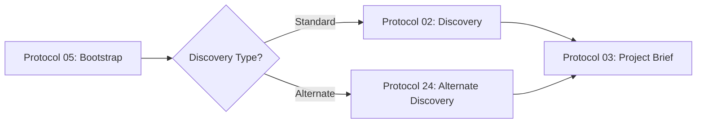

# Protocol Branching Decision Guide

**Purpose**: Clarify when to use alternate protocol paths in the AI-Driven Workflow System

---

## Discovery Phase Branching: Protocol 02 vs Protocol 24

### Overview
The workflow offers two client discovery protocols:
- **Protocol 02**: Client Discovery Initiation (Standard Track)
- **Protocol 24**: Client Discovery Alternate Track

### Decision Criteria

#### Use Protocol 02 (Standard Track) when:
- ✅ **New client engagement** with no prior working history
- ✅ **Waterfall or traditional project methodology** required
- ✅ **Comprehensive discovery needed** across all business domains
- ✅ **Fixed-scope project** with detailed upfront requirements
- ✅ **Compliance-heavy projects** requiring extensive documentation
- ✅ **Large organizational stakeholders** needing formal discovery process
- ✅ **RFP response** or formal proposal requirements

#### Use Protocol 24 (Alternate Track) when:
- ✅ **Existing client** with established working relationship
- ✅ **Agile/iterative methodology** with evolving requirements
- ✅ **Quick discovery** for feature additions or enhancements
- ✅ **MVP or prototype** projects with rapid time-to-market needs
- ✅ **Startup or small team** environments with lean processes
- ✅ **Internal projects** with direct stakeholder access
- ✅ **Follow-on work** from previous engagements

### Key Differences

| Aspect | Protocol 02 (Standard) | Protocol 24 (Alternate) |
|--------|------------------------|-------------------------|
| **Duration** | 2-4 weeks | 3-5 days |
| **Depth** | Comprehensive | Focused |
| **Stakeholders** | Multiple levels | Direct team |
| **Documentation** | Extensive | Lean |
| **Formality** | High | Moderate |
| **Artifacts** | Full discovery package | Essential brief |

### Workflow Integration

### Transitioning Between Tracks

**If you start with Protocol 24 but need more depth:**
1. Complete Protocol 24 artifacts
2. Identify specific gaps requiring deeper discovery
3. Execute relevant sections of Protocol 02
4. Consolidate findings before proceeding to Protocol 03

**If Protocol 02 feels too heavy:**
1. Assess actual discovery needs vs. compliance requirements
2. Consider hybrid approach: Protocol 24 with selective Protocol 02 sections
3. Document decision and rationale for stakeholder alignment

---

## Best Practices

### For Protocol 02:
- Schedule formal discovery workshops
- Prepare detailed discovery templates
- Allow buffer time for stakeholder coordination
- Create comprehensive evidence packages

### For Protocol 24:
- Focus on essential discovery questions
- Leverage existing knowledge and relationships
- Iterate quickly on findings
- Keep documentation concise but complete

### Warning Signs

**Switch from P24 to P02 if:**
- ❌ Stakeholder misalignment emerging
- ❌ Scope ambiguity causing delays
- ❌ Compliance requirements surfacing
- ❌ Multiple approval layers discovered

**Switch from P02 to P24 if:**
- ❌ Discovery overhead slowing progress
- ❌ Stakeholders pushing for faster delivery
- ❌ Requirements already well-understood
- ❌ Low regulatory/compliance burden

---

## Default Recommendation

**When in doubt, start with Protocol 02** (Standard Track). It's easier to streamline a comprehensive discovery than to retrofit missing context later.

For experienced teams with established clients, Protocol 24 offers significant time savings without compromising quality.

---

**Last Updated**: 2025-10-21  
**Related Protocols**: 02, 05, 24  
**Maintained By**: Workflow Governance Team
