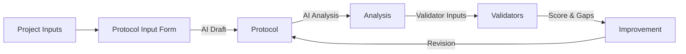

# 📁 Generators System – Protocol & Evidence Automation

The `generators/` directory hosts the tooling, prompts, and forms that let AI assistants and operators derive new workflow assets directly from the 23-protocol lifecycle. Two primary outcomes drive this folder:

1. **Meta-analysis generation** – Translate any protocol into a structured analysis artifact for audits or validator inputs.
2. **Protocol drafting** – Produce brand-new protocols from standardized inputs while preserving the canonical format and governance requirements.

---

## 📂 Folder Map

| Path | Purpose |
| --- | --- |
| `GENERATORS-INDEX.md` | Navigation hub with links to every guide and template |
| `QUICK-START-GENERATORS.md` | 5-minute onboarding for new operators |
| `GENERATOR-SYSTEM-SUMMARY.md` | Full documentation for the generator stack |
| `meta-analysis-generator-instructions.md` | AI prompt script for “Protocol → Meta Analysis” conversions |
| `protocol-generator-instructions.md` | AI prompt script for “Requirements → Protocol” drafting |
| `protocol-input-form.yaml` | Blank YAML form capturing project context, evidence, gates, and outcomes |
| `sample-filled-form.yaml` | Example of a completed input form |
| `analysis-6-deployment-automation.md` | Sample meta-analysis output |
| `6-deployment-automation.md` | Sample generated protocol following the 23-protocol format |

---

## 🚀 Quick Start

### Need an Analysis?
1. Open `meta-analysis-generator-instructions.md`.
2. Provide the target protocol markdown.
3. Request an AI assistant to generate the analysis document.

### Need a New Protocol?
1. Fill out `protocol-input-form.yaml` (clone `sample-filled-form.yaml` for guidance).
2. Feed the populated form into `protocol-generator-instructions.md`.
3. Validate the draft against the canonical structure (purpose, prerequisites, steps, evidence, quality gates, script hooks).

### Cross-check Outcomes
- Use `analysis-*.md` files to confirm evidence layers (structural, process, decision, integration) are captured.
- Feed generated protocols back into the meta-analysis workflow to ensure consistency with validator expectations.

---

## 🔄 Feedback Loop with the 23-Protocol Lifecycle

This closed loop keeps new or revised protocols aligned with governance requirements and downstream validator criteria.

---

## ✅ Usage Checklist

- [ ] Identify target protocol or desired workflow outcome.
- [ ] Prepare the latest context (brief, gates, evidence expectations).
- [ ] Use the matching generator prompt (analysis or protocol drafting).
- [ ] Validate outputs against `.cursor/ai-driven-workflow/AGENTS.md` and integration maps.
- [ ] Archive generated artifacts in `.artifacts/` with evidence manifests if promoted to production.

---

## 🧭 Suggested Learning Path

1. Read `QUICK-START-GENERATORS.md` for orientation.
2. Review `GENERATOR-SYSTEM-SUMMARY.md` to understand architecture and safeguards.
3. Study the sample pair (`sample-filled-form.yaml`, `6-deployment-automation.md`, `analysis-6-deployment-automation.md`).
4. Run the loop end-to-end with a low-risk protocol before proposing changes to core protocols.

---

## 🤝 Support & Contributions

- Governance rules live in `.cursor/ai-driven-workflow/AGENTS.md` and `COMMAND-PLAYBOOK.md`.
- When submitting new protocols, include the filled YAML form and matching analysis artifact.
- Flag improvements or gaps via `documentation/pr-reviews/` playbooks to route feedback through protocol governors.

Everything in this directory is built to keep protocol evolution consistent, auditable, and aligned with the AI-driven workflow lifecycle. Use it to extend the system responsibly! 🚀
